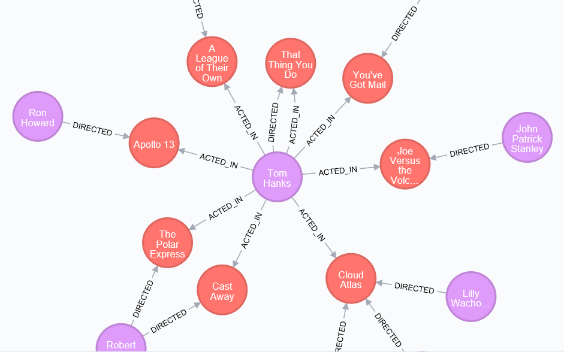

介绍图数据库中属性图的查询语言——Cypher，这是一篇CCF A类文章，发表于数据库顶会SIGMOD，讲得很详细很不错！[原文链接](http://people.csail.mit.edu/jshun/6886-s18/papers/Cypher.pdf)
<!--more-->

---
@Authors：Nadime Francis，Alastair Green，Paolo Guagliardo
@Published in: SIGMOD Conference 2018: 1433-1445
@Presented by: Yina Lv , Time: Qct 10, 2018
@Action：October 11, 2018 9:21 AM

---

## Schema
  - 介绍了属性图和Cypher语言的语法结构
  - 以事例的形式讲述Cypher查询过程
  - Cypher中的核心元素：数据模型和查询语言
  - pattern matching
  - 比较Cypher语言和其他数据库查询语言的特征，描述其扩展性、先进性，并将发展成Cypher10

## 1.Introduce
### 1.1 Property graph database

- `Property graph database`such as Neo4j，JanusGraph and Sparksee have become more widespread in industry and academia.
- used in multiple domains, such as master data and knowledge management, recommendation engines,fraud detection, IT operations and network management, authorization and access control , bioinformatics , social networks, software system analysis , and in investigative journalism.
- **Benefits:**
   - explicit support for modeling graph data
   - native indexing
   - storage for fast graph traversal operations
   - built-in support for graph algorithms
   - the provision of graph language

### 1.2 Cypher
- `Cypher`: a well-established language for querying and updating property graph databases

  - began life in the Neo4j product, but has now been implemented commercially in other products such as SAP HANA Graph, Redis Graph, Agens Graph (over PostgreSQL) and Memgraph.
  - Cypher is also used in several research projects (e.g., Ingraph ,Gradoop , and Cytosm) as well as in recent or incubating open-source projects, such as Cypher for Apache Spark and Cypher over Gremlin.
  - Cypher是线性查询，输入property graph，输出table
  - 数据更新：
    - `CREATE`: creating new nodes and relationships
    - `DELETE`: moving entities
    - `SET`: updating properties
    - `MERGE`: try to match the given patten,and creates the pattern if no match was found

## 2.Example

**Graph Schema：**

 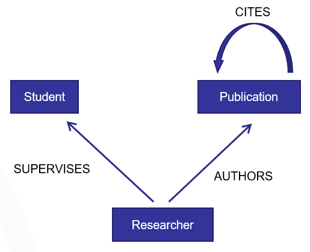 

 - PS:图中有三个label，分别是`researcher`、`Student`、`Publication`，三种关系:`SUPERVISES`、`AUTHORS`、`CITES`
 - 研究员有指导的学生，研究员发表刊物，那么就是某刊物的作者，刊物之间可以互相引用。
 - CITES我画成了自循环，但是大家这样理解比较合适：一个刊物可以被另外一个刊物引用。

**Big graph:(整个数据库的属性图如下)**
  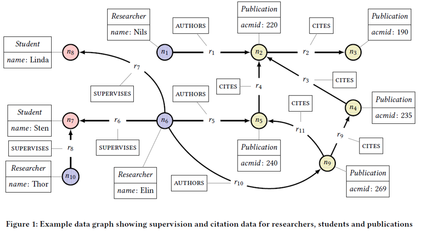
### 2.1 查询示例语句如下：

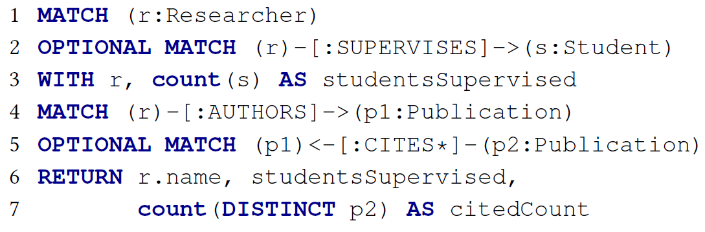

**Q: 返回图G中每个researcher的name，他们所supervises指向的学生数，以及他们撰写的出版物被其他出版物直接或间接引用的次数。**

我们分析每一个语句的查询结果。
1. `MATCH (r:researcher)`
  - 在这句语句中，r是instance，researcher是label
  
2. `OPTIONAL MATCH (r)-[:SUPERVISES]->(s:Student)`
  - `OPTIONAL MATCH`与`MATCH`的区别在于，`OPTIONAL MATCH`会返回查询结果为`NULL`的记录。
  - `SUPERVISES`为关系的`label`，`(r)-[:SUPERVISES]->(s:Student)`表示找出researcher对应指导的学生实例
  - 1、2两句语句执行结果如下：
	
  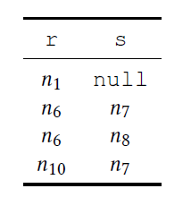

	
3. `WITH r,count(s) AS studentsSupervised`
  - AS：取别名
  - count(s):计算上面找出的学生数
  - 在with语句前面部分找出的子图作为with语句后面查询的驱动表
	
  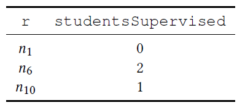

	
4. `MATCH (r)-[:AUTHORS]->(p1:Publication)`
  - n10不写是因为`MATCH`不返回`NULL`的记录
    
 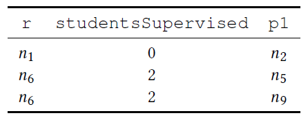

5. `OPTIONAL MATCH (p1)-[:CITES*]->(p2:Publication)`
  - `CITES`后面的`*`表示任意步长，当然也可以指定步长，比如`CITES*1..3`表示跳一步到三步
  - 结果中的n9有两个是因为n9可以有两条路径达到n2
	
 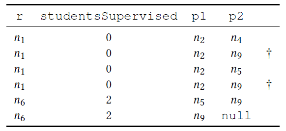

6、7. `RETURN r.name,studentsSupervised,count(DISTINCT p2) AS citedCount`
  - 返回最后的结果
    
 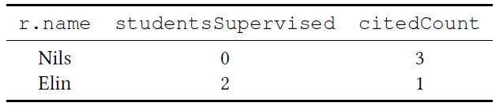

### 2.2 Examples from industry

**Q1: A real-world query from the network management domain**
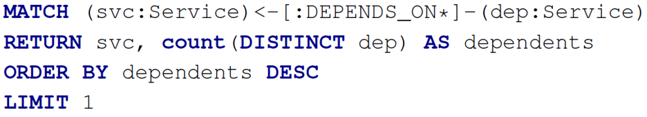
  - The query returns the component that is depended upon – both directly and indirectly – by the largest number of entities.
  - `order by`: 排序，可指定增序还是降序
  - `LIMIT`：取几行记录
  - MATCH中的箭头可以向左也可以向右

**Q2: A query in the domain of fraud detection**
  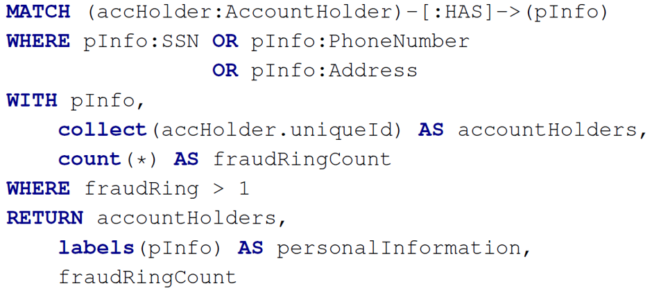

  - pInfo后面三个为label，可以将pInfo理解为节点信息，那么语句的意思就是信息可以是SSN，或者PhoneNumber，或者Address
  - WHERE后面跟着的是一些过滤条件，这些过滤条件也可以放在MATCH后面，比如第一个where后面跟着实例的标签，那么也可以写成`MATCH (accHolder:AccountHolder)-[:HAS]->(pInfo:SSN:PhoneNumber:Address)`
  - `collect()`: 返回表达式表示的值，放入`list`并返回
  - `labels()`: 返回一个节点的所有标签，以`list`的形式返回
  - `count(*)`: 用于计算匹配的行数

## 3.FORMAL SPECIFICATION
  - The key elements of Cypher are as follows:
	- `data model`, that includes values, graphs, and tables;
	- `query language`, that includes expressions, patterns, clauses, and queries.
  - `Property graphs`
  
 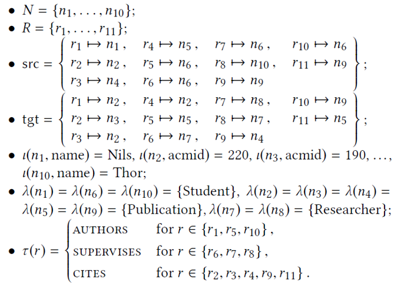

  
	- We now refer to the property graph in Figure 1 and show how, for a sample of its nodes and relationships, it is formally represented in this model as a graph `G = (N, R, src, tgt, ι, λ, τ )`.
	- N: 实例
	- R: 关系
	- src：从关系到源节点这样的存储结构
	- tgt：从关系到目标节点这样的存储结构
	- ι(n1,name)=Nils: 节点1的名字叫Nils，存储(key,value)的形式
	- λ(n1)={Student}: 存储节点label
	- τ(r)=AUTHORS: 存储关系的label

