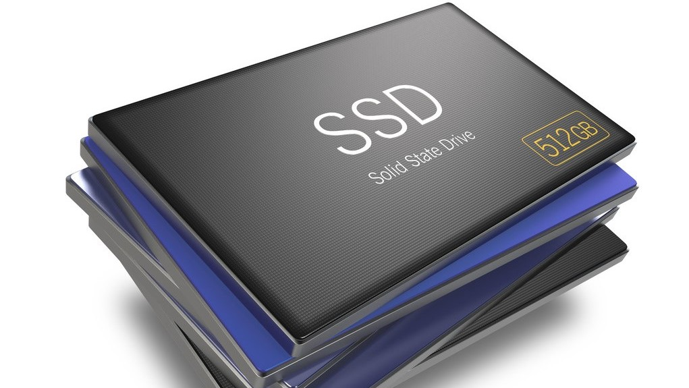
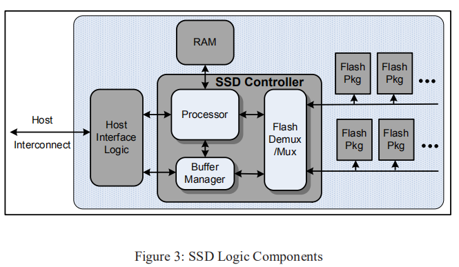
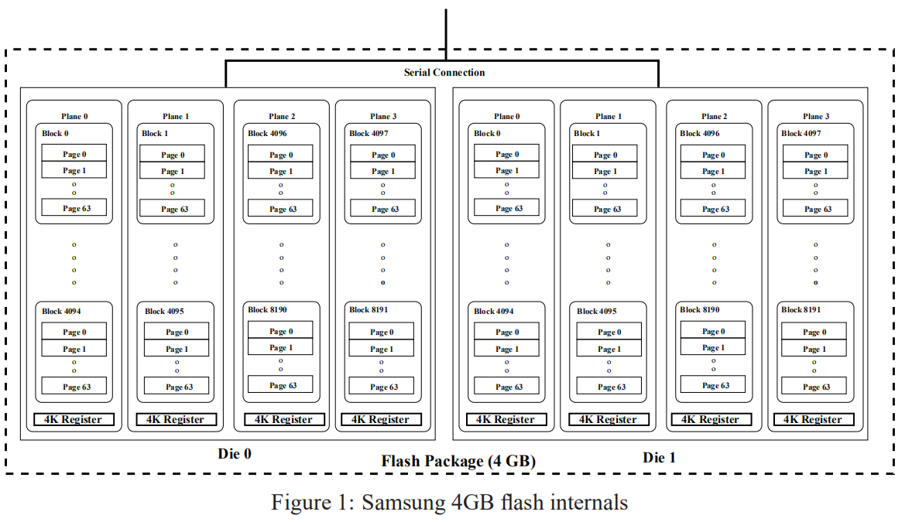
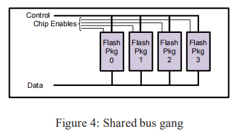
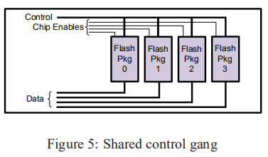

本文主要讨论FLASH阵列的组织以及管理逻辑磁盘和物理闪存地址之间的映射所需的算法,是解决围绕SSD逻辑元件的设计和布局的许多重要问题的论文[原文链接](https://discl.cs.ttu.edu/lib/exe/fetch.php?media=wiki:usenix08.pdf)

<!--more-->

---
@Author: Nitin Agrawal，Vijayan Prabhakaran，Ted Wobber...
@Publiced in: 2008 USENIX Annual Technical Conference, Boston, MA, USA, June 22-27, 2008. Proceedings
@Action: November 14, 2018 8:14 PM

---

### 关于SSD

一般的闪存分为两种：NAND和NOR
其中，NAND-flash是掉电后非易失性存储体
NOR以储存程序代码为主，对于存储量少且需要多次擦除操作的代码使用NOR比较合适，NAND，容量大，适用于高数据存储密度

- NOR的读速度比NAND稍快一些
- NAND的写入速度比NOR快很多
- NAND的擦除速度远比NOR快
- NAND的擦除单元更小，相应的擦除电路更加简单
- NAND的实际应用方式要比NOR复杂的多
- NOR可以直接使用，并在上面直接运行代码，而NAND需要I/O接口，因此使用时需要驱动

	

图3描述了SSD的通用框图

- 主机接口逻辑(`Host Interface logic`)，以支持一些物理主机接口(USB、FiberChannel、PCIExpress、SATA)和逻辑磁盘仿真，如flash translation layer机制，使SSD能够模拟硬盘驱动器
这个主机接口带宽必须与闪存阵列的配置相匹配

- `internal buffer manager`用来保存数据请求
- 多路复用器(`FlashDemux/Mux`)发出命令并沿串行连接到闪存包来处理数据的传输，这个多路复用器可以包含额外的逻辑，比如说缓冲命令和数据
- `processing engine` 也用来管理请求流和从磁盘逻辑块到物理闪存的地址映射
- `processor`，`buffer manager`和`multiplexer`通常在诸如ASIC或FPGA之类的离散组件中实现，并且这些逻辑元素之间的数据流非常快

>`Chanel`——`chip/pkg`——`die`——`plane`——`block`——`page`
- 其中，block和page不可以并发执行
- 一般每个die中有2/4个plane 根据带宽需求来进行data allocation分配资源
- read（25微秒）、write（100微秒）、erase（1毫秒）操作
- 写操作不能就地更新，那么，将当前要写的page先拷贝到一个新的block中或者在同一个block的空闲页中。然后将当前页设为Invalid。

>**什么时候将这些Invalid page擦除呢？**

>- 用一个block来存储每一个block中无效页的数目，每次erase的时候，选无效页最多的block,将这个块中的有效页放入另一个空闲块中，然后erase当前块。这里需要注意的是每次erase的时候按块大小擦除。

**关于mapping table 和 data Allocation的区别？**
- 在mapping table当中存的信息是，在哪个plane中的哪个block中的哪个page
- 而data allocation考虑的是哪个Chip哪个die哪个plane，考虑的是资源方面
- 根据`带宽需求`来进行data allocation分配资源

### Logical Block Map

假设逻辑块映射保存在易失性存储器中，并在启动时从稳定存储中重建。

当处理写入操作时，从一个闪存的预定池中获得一个4KB目标逻辑页。
考虑以下分配池属性：

- `静态映射`，每个LBA的一部分构成到特定分配池的固定映射
- `动态映射`，并不固定，等需要时再进行分配
- `逻辑页大小`，映射项的引用大小可能与闪存块(256 KB)一样大，也可能小到四分之一页(1KB)
- `页面跨度`，每个逻辑页存在于不同的闪存包，这样就可以实现并发性
- `加载均衡`，I/O操作应该在分配池之间平衡
- `并发访问`，将LBA分配给物理地址应尽可能少地干扰并行访问这些LBA的能力。例如，如果LBA 0……LBAn总是在同一个ti访问，它们不应该存储在一个要求串行访问的组件上
- `块擦除`，块必须在擦除后才可以重写，且仅仅那些大小固定的连续页组成的块才能被擦除

定义分配池的变量与这些约束进行权衡

 1. 如果LBA空间的大部分是静态映射的，那么负载平衡的余地很小
 2. 如果将连续范围的LBA映射到相同的物理芯片上，则大块顺序访问的性能将受到影响。在逻辑页小的情况下，需要做更多的工作来消除erase操作所带来的影响
 3. 如果逻辑页大小=块大小，则由于写入单元和擦除单元是相同的，因此简化了擦除，但是，所有小于逻辑页面大小的写入都会影响读取 - 修改 - 写入操作，这些操作涉及未被修改的逻辑页面部分

### Cleaning
> ——cleaning是erase前的操作

我们使用FLASH块作为分配池中的自然分配单元。在任何给定的时间，池都可以有一个或多个可用的活动块来保存传入的写操作。为了支持继续分配新的活动块，我们需要一个garbage collector(GC)来枚举以前使用过的块，也就是在写入操作后无效的块（注意之前讲过写操作只能就地更新，这是电路设备所决定的）。这些Invalid块必须被擦除和回收（`这边再提一下下，当进行写入操作时，由于不能就地更新，那么需要在当前块的空闲页或者另一空闲块（只要是空闲的page就可以）写入新数据，将当前页面置为无效，mapping table上索引更改；这个无效页记录在特定的block上，当然记录无效页的block只需要记录每个block中无效页的数量而不需要记录具体哪些页面为无效的`）。
如果逻辑页小于闪存块大小，那么在这个块中就可能包含有效块和无效块，我们要加以区分。必须在擦除之前清理闪存块，`Cleaning`可概括如下：
页面写入完成后，先前映射的页面位置将被取代，因为其内容现已过期。在回收候选区块时，候选区域中所有未被取代的页面必须在擦除之前写入其他位置。

### Parallelism and Interconnect Density

如果要实现ssd的带宽或I/O速率大于单芯片的最大值，它必须能够并行处理多个闪存包上的I/O请求。利用与其引脚的附加串行连接，在与闪存完全连接的前提下，有几种可能的技术可以获得这样的并行性，其中一些我们已经讨论过了。

- `Parallel requests`,在一个完全连接的闪存阵列中，每个元素是一个独立的实体，因此，可以接收一个独立的请求流。然而，对于降低处理能力的实现来说，维护每个元素的队列所需的逻辑的复杂性可能是一个问题。
- `Ganging`，一组闪存包可以同时用于优化多页请求。这样做可以允许并行使用多个包，而不需要多个队列的复杂性。然而， 如果只有一个请求队列流向这样一个组，那么当请求不是全部覆盖时，元素将处于空闲状态。
- `Interleaving`,交织可以用来提高带宽和隐藏代价高昂的操作的延迟
- `Background cleaning`,Cleaning操作在后台持续进行，使用不需要数据穿越串行接口的操作(例如内部复制回)可以帮助隐藏清理成本

当不可能完全连接到闪存包时，情况就变得更加有趣了。对于组织一组闪存包，有两种选择是显而易见的：
1. 所述包连接到串行总线，其中控制器动态地选择每个命令
2. 每个包都有到控制器的单独的数据路径，但是控制引脚连接在一个广播总线中

**configuration：**

1. 如图4所示。数据和控制线是共享的，`Chip Enables用来为每个命令选择一个target（也就是图中的Flash pkg 0~4）`
该方案在不需要更多引脚的情况下增加容量，但不增加带宽。

2. 如图5所示。有一组共享的控制引脚，但是由于每个package有单独的数据路径，所以跨多个包的同步操作可以`并行`。可以从第二个配置中删除Chip Enables，但在这种情况下，所有命令操作作用于整个Falsh Package，没有一个包闲置

`Interleaving`可以在一个元件上执行诸如块擦除之类的长时间运行操作，而在其他元件上进行读取或写入（因此控制线只需要保持足够长的时间以发出命令。
唯一的限制是对共享数据和命令总线的竞争。在块回收过程中，这一点可能变得非常重要，因为块擦除比其他块擦除要贵一个数量级

