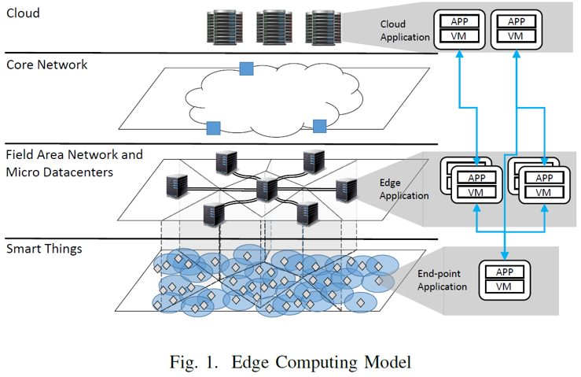
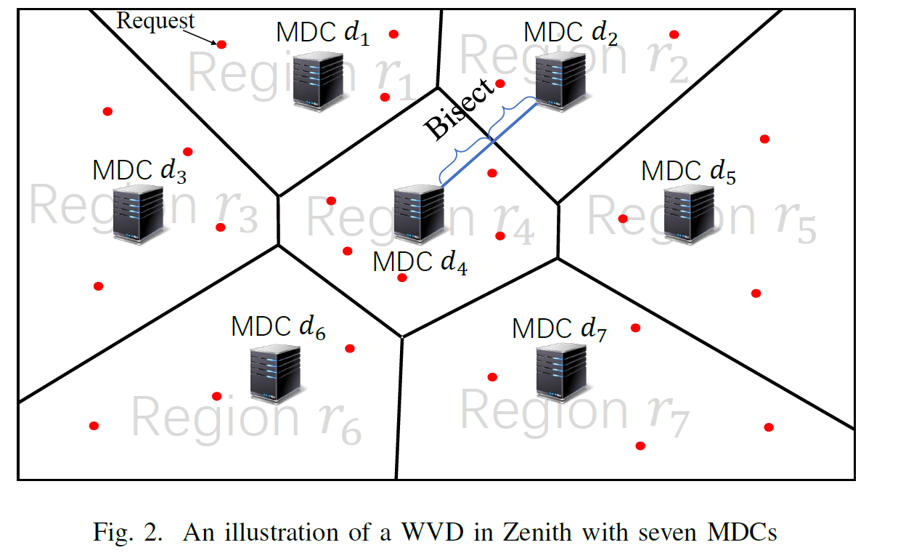
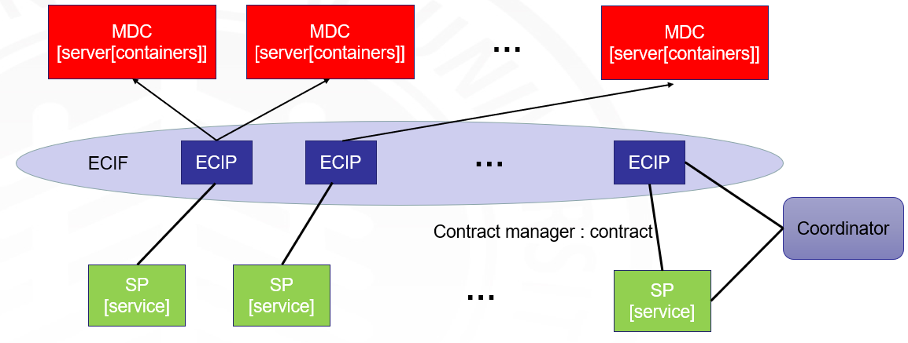
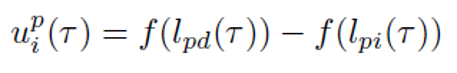
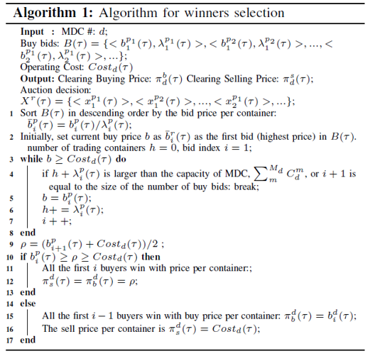
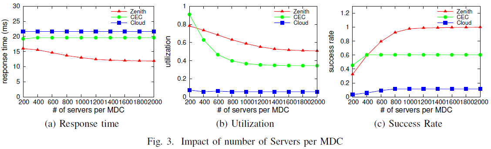
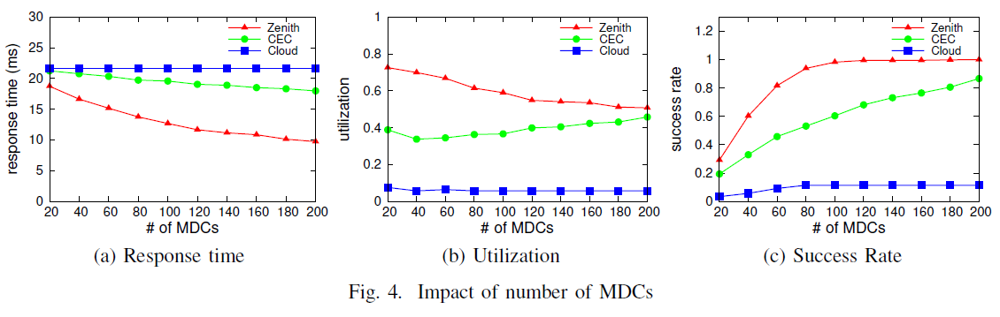
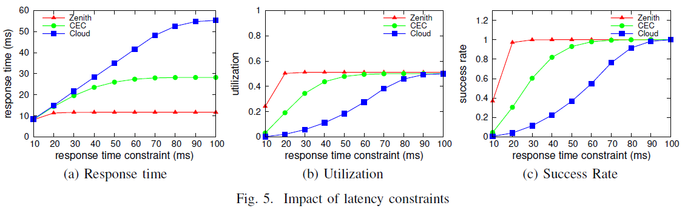

 介绍一种在边缘计算中的共享资源分配模型。 [原文链接](http://xueshu.baidu.com/s?wd=paperuri%3A%2835eedc5032f2ab14412eb9d03f44c4db%29&filter=sc_long_sign&tn=SE_xueshusource_2kduw22v&sc_vurl=http%3A%2F%2Fieeexplore.ieee.org%2Fdocument%2F8029256%2F&ie=utf-8&sc_us=2927924244757260204)

<!--more-->
---
@Authors：Jinlai Xu，Balaji Palanisamy，Heiko Ludwig，Qingyang Wang
@Published in: IEEE International Conference on Edge Computing
@Presented by: Yina Lv , Time: Qct 10, 2018
@Action：October 10, 2018 11:55 PM

---

### Schema

- 首先，提出Zenith，一种解耦的资源分配模型，它管理在边缘分布的计算资源的分配，而与服务提供商端执行的服务供应管理无关。
- 其次，基于该模型，开发了基于拍卖的资源共享合同建立和分配机制，以确保ECIP（边缘计算基础设施提供商）和SP（服务提供商）的真实性和效用最大化。
- 第三，我们开发了一种延迟感知任务调度机制，该机制将合同中提交的资源分配给工作负载中的特定作业。
- 最后，我们通过广泛的实验来评估所提出的技术，这些实验证明了所提出模型的有效性，可扩展性和性能。

### Introduce
 - 在物联网领域，一些对时间敏感的应用需求在不断上升，例如，基于位置的增强现实游戏、实时智能电网管理、使用可穿戴设备的实施导航等。
 

 - 而在边缘计算模型中，提供了额外的基础架构层，以填补物联网设备和后端计算基础架构之间的延迟差距。
 - 在上述的边缘计算模型中，代表计算基础设施的Ad hoc和分布式集合的小规模微数据中心在管理和有效资源共享方面需要改进，以实现全球资源的有效分配。

### Problems
 - 限制了成本效益的提高
 - 延时高
 - 系统总体利用率低

### Model
 - 在本文中，提出了一种在边缘计算平台中分配资源的新模型——**Zenith**。将基础架构（ECI）的管理和服务管理分离，使ECI独立于服务供应商（SP）的服务供应和服务管理，而由边缘计算基础架构供应商（ECIP）管理，并且SP与ECIP建立资源共享合同。基于已经建立的合同，SP采用**延迟感知调度和资源供应算法**，使任务能够完成并满足其延迟要求。
 - 下面是Zenith的架构和模型

  - 在这幅图中，我们考虑这样一个问题：每个MDC管理哪些request呢？
    - 采取延迟最小，这是个NP-hard问题，因此我们将延迟最小化问题转化为地域划分问题，这种方式称为WVD（Weighted Voronoi Diagrams）
    - WVD方法在GIS、sensor networks 和wireless networks广泛应用
    - MDC根据historical workload来调整自身管理区域大小

 - Zenith的资源分配策略
  - **SP** ：buys resources, pay for the contract and has the right to observe the performance of the resource that is allocated to it.
  - **ECIP** ：sells resources, it must guarantee the performance of the resources which are leased to the buyers. It collects the payments from the buyers.
  - **Coordinator** ：a third-party service which is trusted by the ECIPs and SPs in the system and it is responsible for providing a platform for the ECIPs to trade resources with the SPs.
  - **contract manager** ：a component associated with both the SP and ECIP to manage the resource sharing contracts agreed by them.

  - 每个红色表示的MDC中有很多的server，每个server中有很多的container，用于处理请求的设备资源
  - 蓝色表示的ECIP组成ECIF（edge computing infrastructure federation）
  - 每个绿色表示的SP中可以同时有多个service
  - ECIP和SP签订contract，contract的签订需要第三方coordinator，在签订之后，SP可获得一定的containers处理service
  - ECIP和SP之间采用按需租用，ECIP需要保证租给SP的设备资源的性能，SP可以查看租用设备资源的性能
  - 所谓按需租用：service command越大->workload越高->需要的container也多
  - 签订的contract由contract manager管理

### Bidding Strategy

 - For SP, the bidding strategy is to bid by the true value that the SP believes for the resources, which is represented by the utility function we discussed above.

 - For MDC, the sell bid is set to the operating cost, which means if the bid wins, the MDC can at least break even the cost.

### McAfee mechanism：The winning bids decision algorithm

 - Step1：SP估计每个区域r中每个位置的工作量，以获得估计的工作量
 - Step2: 协调员使用算法1为每个区域r决定中标，每个获胜者和MDC的所有者建立合同
 - Step3: 如果MDC没有销售完所有的资源，此时这轮的拍卖结束，那么MDC参加下一轮的拍卖

### Experiment
- 通过广泛的实验评估所提出的技术，实验中考虑了三个性能指标：工作响应时间，满足响应时间的成功率，资源利用率。通过改变三个参数来测试以上性能：每个MDC中服务器的数目，MDC的数目，响应时间的约束。实验结果表明，所提出的模型无论是性能、有效性还是扩展性均比CEC和Cloud的要好。
  - CEC：每个MDC由一个SP拥有，MDC的workload仅来自拥有MDC的SP
  - Cloud：传统的云计算，workload位于左右两端的大型数据处理中心
- Exp1:study the impact of the number of servers in MDCs on the average response time of tasks, the average utilization at the MDCs and the overall success rate of the tasks.

- Exp2:study the impact of the number of MDCs in the geographic map.

- Exp3:analyze the impact of different response time constraints on the perceived performance efficiency.

- 该实验证明了所提出的模型的有效性，可扩展性和性能效率。

### “I want to say”

大家对于投标拍卖策略有明确看法的可以在下面留言或者Email哦，期待和大家的学术交流~

