2010年ACM国际会议文章。本文在前人提出的基于precomputed sketches的距离估计算法基础上，提出了一种快速、准确的最短路径逼近算法。实现误差小、查询时间短，并尽可能地多返回候选路径。[原文链接](http://citeseerx.ist.psu.edu/viewdoc/download;jsessionid=20122B65F8FABE09ABC2F9FEC868A48B?doi=10.1.1.434.8579&rep=rep1&type=pdf)

<!--more-->

---
@Authors：Andrey Gubichev, Srikanta Bedathur, Stephan Seufert, Gerhard Weikum
@Published in: ACM International Conference on Information and Knowledge Management, 2010 :499-508
@Presented by: Yina Lv , Time: Qct 26, 2018
@Action：October 22, 2018 11:08 AM

---

## 1.工作概述

 1. 提出a scalable sketch-based index structure，引入`path-sketches`，可以有效地用于小直径的large graphs（例如,大多数在线社交网络）。`path-sketches`保留每个节点与选定的一组`landmark nodes`之间的完整路径信息，作为图形预处理步骤的一部分
 2. 开发了一套轻量级但高效的技术，这些技术使用`path-sketches`显著提高最短路径估计的质量
 3. 随着对最短路径距离的估计，我们展示了如何在没有计算开销的情况下按照其长度的递增顺序生成`路径队列`，这是许多应用程序在社交和生物网络上的重要需求
 4. 最后，我们在一个功能齐全的大规模图形处理引擎RDF-3X中实现所有提出的方法，并对许多真实世界的大规模图进行评估,实现查询响应时间比传统路径计算快几个数量级，同时将平均估计误差保持在0％和1％之间

## 2.背景

在现代数字世界中，图的广泛应用，比如在线社交网络中(LinkedIn,Facebook,MySpace)，大规模知识中的综合实体关系，边缘存储库，生物交互模型，交通网络，万维网文档之间巨大的超链接图，XML数据，等等

例如：
 1. 社交网络中，一个人可以从他朋友那里得知他最喜欢的雇主的招聘经理。我们可以想到六度空间理论，你和任何一个陌生人之间所间隔的人不会超过六个，也就是说，最多通过五个中间人你就能够认识任何一个陌生人
 2. 生物网络模拟生物体内的复杂化学过程。生物学家可能对识别两种目标代谢物之间的生物转化途径感兴趣，以帮助设计实验

在许多情况下，图中节点数和边的数目达到了数百万个，出于可伸缩性的原因，为了让内存和处理器资源消耗最小化，每一个最短路径的查询实例必须要尽可能快。

- 是什么让最短路径计算在大图上特别难？
    - Dijkstra算法是计算图中两个节点间最短路径的经典方法，时间复杂度为O(m+nlog(n)),其中，n是节点数，m是边数
    - 对于节点数和边数非常多的情况计算时间很大。由于Dijkstra的算法必须构建和维护到图中所有节点的最短路径

## 3.算法描述

### 3.1 准备工作

G = (V, E)是一个有向图，节点集V，边集E。一条路径p的长度为l，且l∈N，那么节点数为l+1。如果一条路径存在，那么可表示为如下形式：
p = (v1,v2 ,…,vl+1),vi∈V,1≤i≤l+1;(vi,vi+1)∈E,1≤i≤l

对于一个节点v∈V，用S(v)表示v的后继节点集合，即具有(v,w)∈E的顶点集w∈V。其中(v,w)表示节点v指向节点w。因此，我们也可得到vi+1∈S(vi)

`|p|=l`表示路径p的长度。对于节点u,v∈V，`P(u,v)`表示从u到v的所有路径集合。`dist(u,v)`表示从u到v的距离,是最短路径中的边数，如果不能从u到达v，则为无穷大。
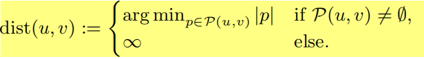

**路径估计**
设两个顶点u,v∈V，设p表示从u到v的最短路径(注意可以有多条)，即从u开始，以v结尾的路径，长度为`|p|=dist(u，v)`。此外，q作为从u到v的任意路径，通过将q看作最短路径p的逼近，我们可以定义这条路径的逼近误差为
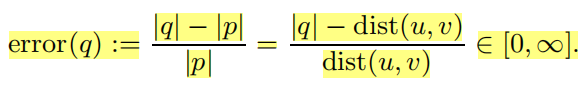

**路径级联**
设p=(u1，u2，... ，uL1，uL1+1)和q=(v1，v2，... ，vL2+1)路径长分别是L1和L2。假设uL1+1=v1，即路径p中的最后一个节点等于路径q中的第一个节点。然后，通过将路径p和q连接起来，可以创建长度为L1+L2的新路径(以p◦q表示)：
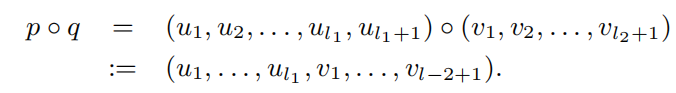

### 3.2 Sketch Algorithm

`Sketch Algorithm`使用`landmark-based`的方法近似计算一般图中两个给定节点之间的最短路径长度

为了实时地回答一对节点的距离查询，该算法采用了两阶段的方法：
 1. 预处理生成`Sketch`(从所有顶点到landmark节点的距离)
 2. 使用这些预先计算的数据，在查询时可快速得到节点近似距离。通过查询的源节点s和目标节点t与landmark节点l之间的距离`dist(s,l)`、`dist(l,d)`。那么 `s→t` 近似距离为:
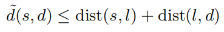

在提出`Sketch Algorithm`的文章中，作者建议为每个节点v存储节点到某些landmark节点的距离`dist(v，·)`和`dist(·，v)`作为预处理的结果。这组`node-landmark`距离称为`sketch of a node`

**我们的做法（在原先算法基础上做了修改）：**
- 在预处理阶段不仅计算距离还存储实际路径！
- 查询节点之间距离的估计，返回的不仅仅是查询节点之间的一条近似路径，即这些路径的队列（按路径长度按照顺序排序）。是因为有时候必须满足对某些节点/边的约束。

#### 3.2.1 预处理

预计算步骤涉及对一些节点集进行采样，为图中的每个节点计算进出该集合中成员的最短路径，并将获得的路径集存储在外部存储器上，这些路径将在稍后的近似步骤中使用。
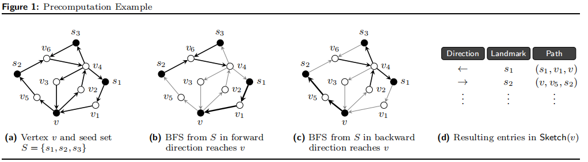

 1. 种子集抽样
 r := ⌊log (n)⌋ ,n=|V|。我们抽取r+1个节点集样本（叫做`seed sets`），并且大小依此为1,2,22,……,2r。标号S0，S1，…… ，Sr

 2. 最短路径计算
 对于每一个样本种子集和每一个节点v∈V，我们计算一条从Si到v的最短路径PSi→v,也就是计算出了任何一个节点到种子集的路径（可能有多条）。接下来，我们从Si出发BFS，构造一颗完全最短路径树。因此，对于每个节点v，我们获得了最接近的种子节点，标记为l1。同理，我们可以计算Pv→Si得到一个l2。那么l1,l2就叫做节点v的关于Si的landmarks。
 - 对于一个节点而言，在一个种子集最多可得到两个landmarks。
 - 每个节点的landmarks不一定相同
 - 2rk个landmarks和路径组成了Sketch(v)

#### 3.2.2 近似最短路径

输入(s,d)，输出ps→d良好的近似最短路径。
>从磁盘导入Sketch(s)和Sketch(d)，并且计算两者的公共landmarks，如果不是公共landmarks去计算的话，要么路径不存在，要么误差相对大。

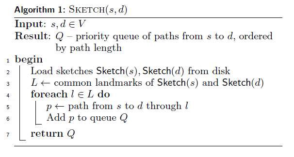

在上述算法中，第五句ps→d := ps→l ◦ pl→d 存储在路径队列中(按路径长度升序排序)，返回回路径的优先级队列。

### 3.3 提高精度

 - Cycle Elimination
 - Shortcutting

#### 3.3.1 Cycle Elimination

在Algorithm 1 提出的算法得到的路径可能是次优的，也就是比真实的最短路径更长,因为它们包含`环`。
ps→l ◦ pl→d = (s, v1, v2, l, v3, v1, d)
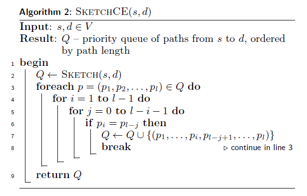

#### 3.3.2 Shortcutting

假设算法返回的队列Q包含路径ps→l→d，从s到d经由landmark l。 路径中的两个节点u，v实际上可能比ps→l→d的相应子路径中包含的节点更紧密。 考虑下面描述的示例：当节点u和v通过长度为3的ps→l→d的子路径连接时，原始图形包含边缘（u，v）。 然后我们可以通过单边（u，v）轻松替换此子路径。
`请注意，在此方式优化的所有情况下，landmark l 一定位于从u到v的子路径中。`

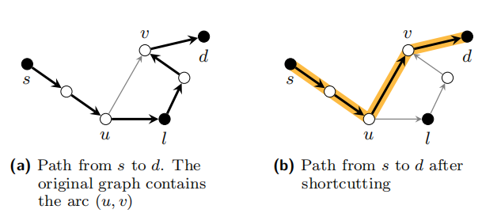

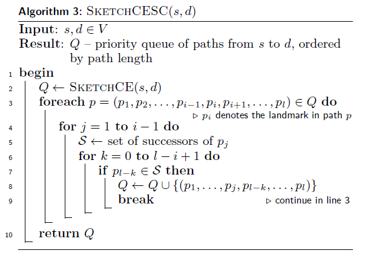

### 3.4 Tree Algorithm
一种新的最短路径近似算法，它也利用了precomputed sketches。
节点v 的Sketch（v）包含两组路径：
 1. 将v连接到landmarks的路径集（称为`forward-directed paths` , 前向路径）
 2. 将landmarks连接到v的路径集（称为`backward-directed paths` , 后向路径）

在无向设置中，两个集合将作为树的叶子和根节点（landmarks作为叶子，节点v作为根）。每棵树的每个内部节点都对应于sketch中一条路径中的一个节点。在有向设置中，只有sketch的forward-directed部分（从v到landmarks）形成一棵树，而backward-directed path产生一个带有“reversed edges”的树,例如，下图a和b：
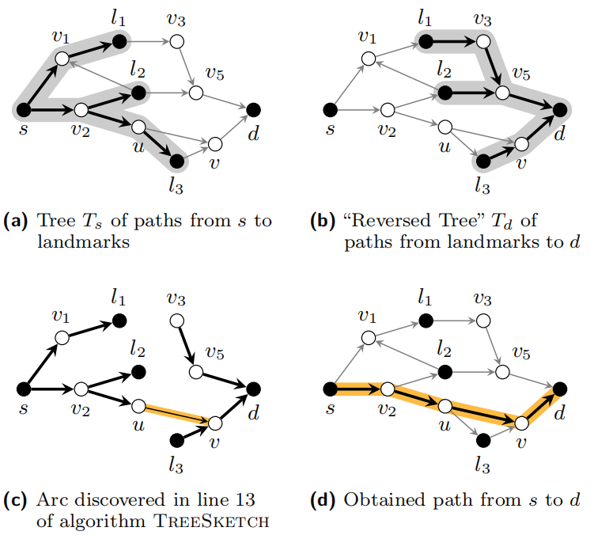

我们提出的新算法，称为`TreeSketch`，将两个查询节点s，d作为输入，从磁盘加载sketch `Sketch（s）`，`Sketch（d）`并构造以s为根的树Ts，其中在Sketch(s)包含存储的所有前向路径。同样地，以d为根的“reversed tree” Td，包含从landmarks到d的所有后向路径。
然后，该算法同时在树上开始两个BFS：在Ts中以s为根节点的BFS(Ts，s)和Td中以d为根节点的RBFS(Td，d)。VBFS和VRBFS表示在各自BFS运行期间访问过的节点集。lshortest表示Q中最短路径的长度。

对于在BFS(Ts,s)过程中遇到的每个顶点u∈VBFS，该算法在原图中加载其继承者的列表S(v)。然后，检查在RBFS期间发现的任何顶点(Td,d)存于S(u)。如果存在这样一个顶点v∈S(u)∩VBFS(见图c)，我们已经找到了从s到d的路径p，如下：
p = ps→u ◦ (u, v) ◦ pv→d
其中ps→u和pv→d分别表示Ts中从s到u的路径和Td中从v到d的路径(图d)。

>代码中10-16行，v——>d路径确定的情况下,找Ts中已访问过的节点中是否有某个节点x的后继节点集包括了v，若包括，那么从x到v存在一条路径，即路径s-->x-->v-->d存在。放入路径优先队列Q中，并与lshortest进行比较
>代码17-23行，s-->u确定的情况下，在RBFS已经访问过的节点集VRBFS中找。若存在某个节点x属于节点u的后继节点，那么存在路径s-->u-->x-->d。放入路径优先队列Q，并与lshortest进行比较
>代码24，如果没有找到比Q中当前最短路径更短的路径，则算法终止。当两个BFS运行的深度总和超过lshortest时就是这种情况。

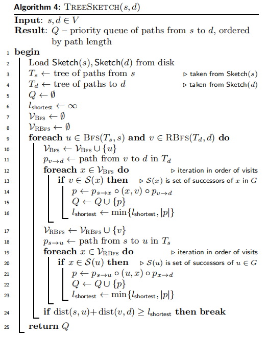

## 4.实现

我们实现了所有方法“Dijkstra”在线最短路径算法以及sketch-based的技术-在RDF-3X中，这是最近提出的用于存储和查询大型RDF图形存储库的高性能数据库系统。在介绍实现细节之前，我们简要介绍一下RDF-3X的背景，重点介绍它是否能够存储高度压缩的大图，同时易于查询。请注意，我们在RDF-3X中省略了查询处理和优化策略的详细信息，因为它们与我们的设置无关。

### 4.1 RDF-3X: RDF Graph Processor

RDF-3X是一个功能齐全的高性能存储引擎和查询处理器，专门用于存储。它基本上将整个图保持为一个巨大的三元组表，这与最近流行的属性表方法形成了对比。
边的三元组形式`<u, e, v>`
在RDF中，`<Subject(S),Predicate(P),Object(O)>`,六个关于S、P、O的组合存于6棵B+树索引中。
每个(SPO，SOP，OSP，OPS，PSO，POS)都有一个索引。通过使用三元组的delta-coding可以显着地压缩每个索引，这是将倒排列表索引中使用的类似压缩的概括推广到id三元组。此外，RDF-3X还构建了6个索引，以便有效地支持分析查询。相反，整个数据库大小包含12个不同的集群B+树索引，上面提到的所有压缩都比三元组形式的原始数据要小。
在我们的实现中，用RDF-3X边存储图，每个边表示为一个三元组`<s，e，t>`。我们不限制RDF-3X自动构建所有12个索引。我们只利用SPO和OPS顺序索引。

**Dijkstra的算法**：在RDF-3X上实现Dijkstra算法基本上涉及在SPO索引上打开扫描，以针对在算法的执行期间访问的每个节点确定所有后继节点。请注意，我们在计算草图时需要反向Dijkstra算法，主要是为了“简单地”打开OPS索引上的扫描，并让算法运行。Dijkstra算法期间所需的优先级队列使用GNU-C++ STL中可用的实现在内存中维护。

### 4.2 Sketch 实现

为简单起见，我们将草图也作为RDF三元组存储在RDF-3X下的单独数据库中。由于sketch（距离和路径sketch）与有向路径相关联，因此我们将其格式设置如下：
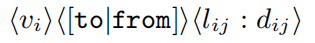
其中，vi是源节点的id，往返是指示路径方向的字符串文字，lij是来自种子集Sj的节点vi的界标，dij是到地标的相应最短距离。同样，路径草图也存储为以下形式的三元组：
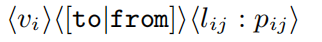
其中pij指的是节点vi和地标节点lij之间路径中节点ID的序列。

应该再次注意的是，RDF-3X在这个三重草图数据库上建立了12个索引，但我们只需要其中一个索引用于我们的最短路径估计算法，即在置换SPO上的B+树。因此，我们在后面的实验部分提供的磁盘空间消耗可以进一步大大减少，尽管草图的相对大小保持不变。在我们所有的实验中默认设置k=2预计算回合。

## 5.实验评估

**步骤**：

- 概述所使用的数据集
- 描述在后续评估中使用的测试实例的生成
- 评估不同方法的逼近质量
- 执行查询运行时间测量
- 简要讨论了路径多样性问题
- 总结，量化了草图预计算的空间和时间要求

### 5.1 使用的数据集

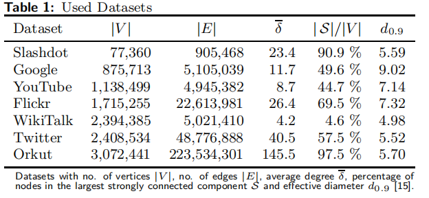

### 5.2 测试实例生成

为了评估算法的逼近质量和运行次数，我们使用了一组表的测试三元组(x,y,dist(x,y)),其中，包括了一对节点x，y和x，y之间的距离dist(x,y)
我们使用Dijkstra的算法，通过均匀采样100个顶点并计算每个顶点的最短路径树(forward and backward direction)来生成这些三元组。作为输出，我们为每个采样顶点v获得一个将顶点连接到每个其他可到达节点的树和一个“反转”树，将存在采样顶点的路径的每个节点连接到v。
结果，我们获得了(x,y,dist(x,y))中所示结构的一组三元组。然后，我们将这些三元组分组为与距离dist（x，y）对应的类别。从每个这样的类别，我们最多采样50个三元组（测试）作为我们的测试集。每个网络的实际测试次数各不相同，因为组的数量以及所包含的三元组的数量可能不同。

### 5.3 结果

#### 5.3.1 逼近质量

为了评估不同算法生成的路径的逼近质量，我们对每一个三元组(s,d,dist(s,d))用SKETCH，SKETCHCE，SKETCHCESC，TREESKETCH四种算法查询。对于每一个最短路径查询(s,d),我们将得到的路径长度lshortest与三元组中真实的最短距离进行比较，按照如下公式计算误差:
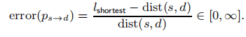
对于每个算法，我们记录所有测试三元组的平均近似误差。所获得的误差值在表2中提供并绘制在图4中，使用对数刻度显示误差值
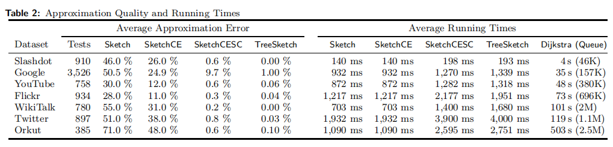

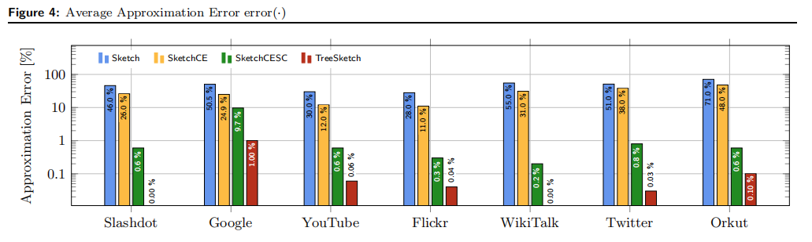

结果显示，我们提出的TREESKETCH算法最优，对于正在考虑的所有数据集，我们的算法能够返回查询节点的最短路径，且在最坏的情况下，平均估计误差为1％，同时为Slashdot和WikiTalk网络提供几乎所有情况下的精确解决方案。

#### 5.3.2 查询执行时间

将我们的方法的结果与Dijkstra算法的平均运行时间进行了比较，如上表2

描述了查询执行时间的半对数图：
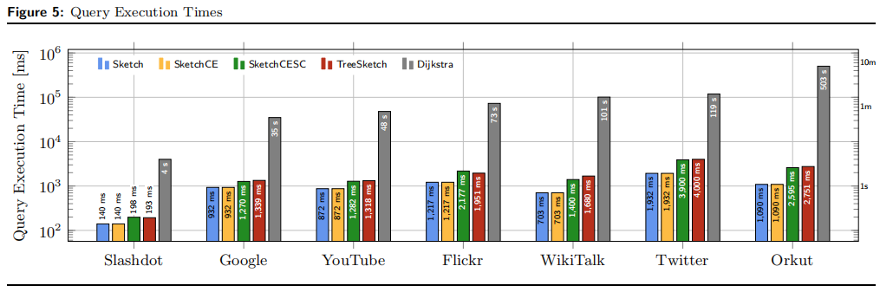

观察到，使用算法SketchCESC，我们能够在最小的数据集（Slashdot）中平均190毫秒内以极高的准确度回答最短路径查询，大型Twitter数据集中4秒。使用TreeSketch，我们可以提供更好的路径估计，提供比Dijkstra算法快一到两个数量级的结果。注意，对于Slashdot和Wikitalk数据集，查询执行速度极快，同时实现0％的近似误差。

#### 5.3.3 路径多样性

在许多应用程序设置中，不仅要快速生成最短路径的精确逼近，而且还必须尽可能多地返回候选路径。
我们的算法被设计成能够满足这个目标。返回一个有序的路径队列，例如，该队列可用于根据特定用户指定的约束筛选候选人。表4给出了生成的最短路径的平均数目。
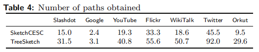

`TreeSketch`创建的候选路径数总是大于其他变量生成的路径数。对于twitter数据集，我们平均可以生成92条路径，是我们SketchCESC算法的两倍。

#### 5.3.4 评估预处理空间和时间要求

我们评估了预处理步骤(the sketch computation)的空间和时间要求。
**空间要求：**
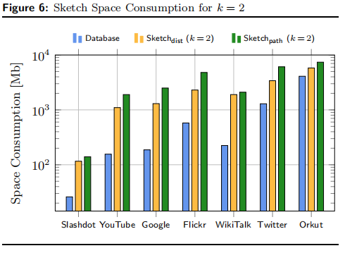
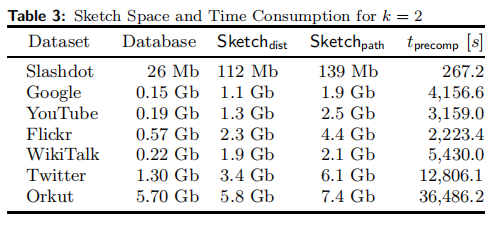

**预处理时间：**
我们测量所有数据集的预处理阶段的运行时间。表4提供了k = 2预处理迭代所需时间的概述。请注意，所需时间以k为线性增加。对于像Slashdot这样的小型数据集，可以在五分钟内获得sketch，而最大的数据集（Orkut）需要大约11个小时的预处理

## “I want to say”

这篇文章就是对原先的sketch算法进行了改进，比如消除环路的存在和shortcutting，以获得更短的路径。并且提出在相同的预先计算的数据上操作的一种全新的Tree sketch算法。此外，还可以生成多条候选路径，作为对一些真实世界数据集的实验评估的基础。
由于文中讨论的是有向图，那么对于上述改进之后，实验效果很可观，但是对于无向图的话，上述方法自然是不可行的。

>码完了！！喜极而泣^^感想省略一百字哈