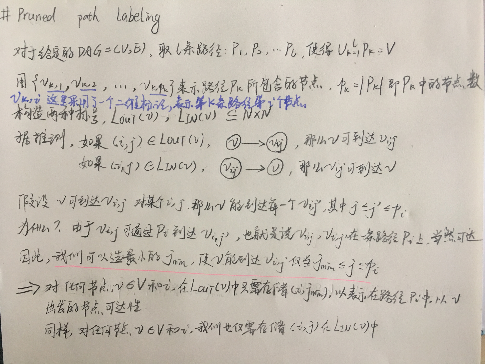
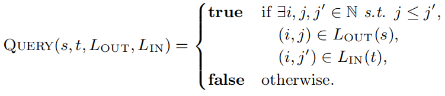
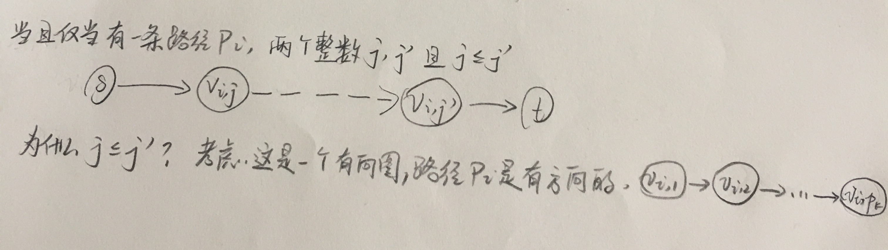
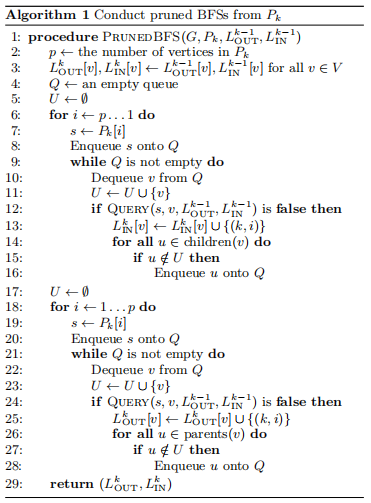
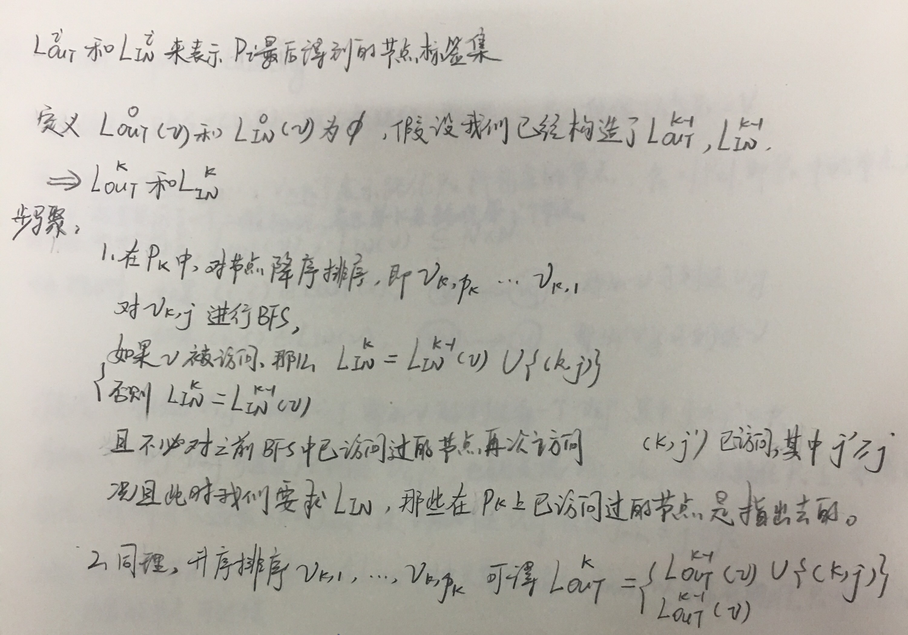
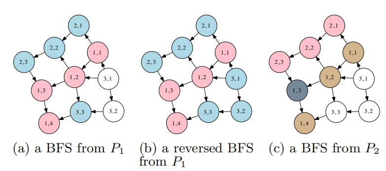
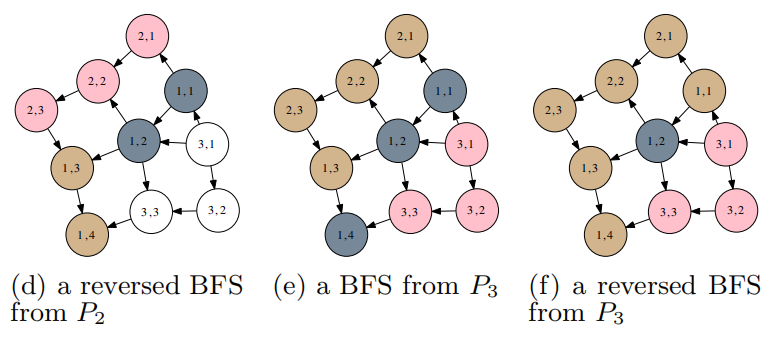
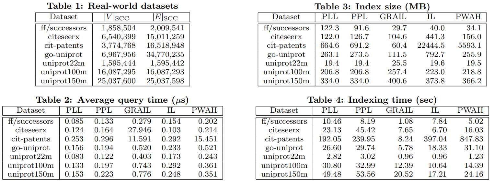
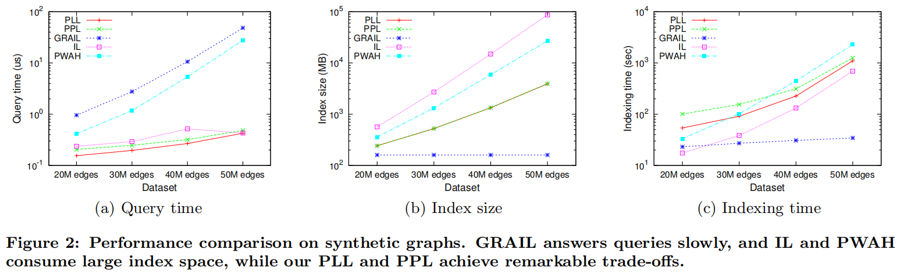

2013年在ACM国际会议上发表的文章，关于图上快速可伸缩查询，也就是求最短路径，文中介绍了一种修剪地标标记和修剪路径标记的新索引算法[原文链接](http://www-imai.is.s.u-tokyo.ac.jp/~takiba/paper/13_cikm_ppl.pdf)

<!--more-->
---
@Authors：Yosuke Yano, Takuya Akiba, Yoichi Iwata, Yuichi Yoshida
@Published in: ACM International Conference on Conference on I... , 2013 :1601-1606
@Presented by: Yina Lv , Time: Qct 26, 2018
@Action：October 21, 2018 9:00 PM

---
## 碎碎念
这次汇报的两篇论文关于图中求最短路径，可以说看得非常头疼了……！这样的文章确实需要看好多遍才能理解哇！还有一篇请看下一篇博文。由于对这方面的知识了解不多，因此我写的较为详细！大家对写论文方面博客有好的建议可以在底部评论区提呀^^

---
@Authors：Yosuke Yano, Takuya Akiba, Yoichi Iwata, Yuichi Yoshida
@Published in: ACM International Conference on Conference on I... , 2013 :1601-1606
@Presented by: Yina Lv , Time: Qct 26, 2018
@Action：October 21, 2018 9:00 PM

---

## Schema
- pruned landmark labeling
- pruned path labeling

## 1.Introduction
### 1.1 背景介绍
- 目前，大型图形数据的出现，提出了很多索引方案。但是，由于当前最先进的方法存在可伸缩性或查询时间过长的缺点，可伸缩性查询的有效处理仍然是一个巨大的问题。最经典的方法之一是压缩传递闭包，但是空间复杂度高。
- `预先计算每个节点的标签，以便可以从两个节点的标签中回答可达性查询。这种方法很有用，因为在获得小标签后，它们可以获得快速查询和较小的索引大小。然而，计算这样的标签一直是具有挑战性且非常昂贵的，因此限制了该方法的可扩展性。`
- 什么是可达性查询(reachability queries)？
给定一个有向图G=(V，E)，回答是否存在从节点s到t的有向路径。若存在，即可达；若不存在，既不可达。这是图上最基本和最重要的操作之一。
eg：在SPARQL和XQuery查询引擎中，这是回答用户查询的基本构件之一。在计算生物学中，它被用来表示和分析分子和细胞的功能。在程序分析中，它实现了精确的过程间数据流分析。

### 1.2 本文工作
- 注意！！本文是针对有向图而提出的。
- 本文提出了一种新的labeling-based的可达性查询方法，即修剪地标标记和修剪路径标记。
- 由于它们都是基于标记的方法，所以它们实现了快速的查询时间和较小的索引大小，它们的索引算法比以前的算法效率要高得多，克服了基于标记的方法的可伸缩性的缺点，并在查询时间、索引大小和可伸缩性之间实现了显著的权衡，这是以前的方法所无法做到的。

**修剪地标标记和剪枝路径标记的新索引算法**

- 剪枝标记采用2-hop，剪枝路径标记采用3-hop。
- 例如，虽然最短路径查询方法是针对社交网络和web图等网络而设计的，但我们设计了适用于实际有向无环图的方法。
- 此外，修剪路径标记的索引算法本质上是一种新算法，它只需一次修剪搜索就可以从路径中的所有节点计算标签条目。

**符号**：设G =（V，E）为有向图。顶点的数量|V|和边数|E|分别由n和m表示。对于两个顶点s,t∈V，如果存在从s到t的路径，则将reach(s,t)定义为true，否则为false。 可达性查询(s,t)询问reach(s,t)是否为真。用dIN（v）和dOUT（v）表示v的indegree(入度)和outdegree(出度)

**强连接组件**：我们可以放心假设输入图始终是有向无环图（DAG）。注意，G的强连通分量（SCC）中的所有顶点在可达性方面是等价的，因为它们彼此可达。因此，G可以通过SCC转换为DAG，并且保留顶点之间的可达性信息。

**问题定义**：问题是为给定的DAG G =（V，E）预先计算一些索引，并通过使用索引快速回答到达能力查询，并在必要时快速回答DAG。 我们假设在索引之后给出所有可达性查询。也就是说，我们无法为特定的查询集创建特殊的索引。

## 2.PRUNED LANDMARK LABELING
给定一个DAG G=(V,E),我们对于每个节点v创建的两个标签LOUT(v)，LIN(v)
对于一个查询(s,t)，返回查询QUERY(s,t,LOUT,LIN):
- QUERY(s, t, LOUT, LIN)为true，LOUT(s)和LIN(t)之间为非空交叉，否则，为false
对每个s,t∈V，构造LOUT和LIN，保持QUERY(s, t, LOUT, LIN)=reach(s,t)
- ls = |LOUT(s)| ， lt = |LIN(t)|
- 原始的算法时间复杂度为 O(ls·lt),若是排序好的， O(ls+lt)

> 为了简单起见，我们首先描述了一种在不剪枝的情况下构造Lout和LIN的算法，然后讨论了一种具有剪枝的算法。

### 2.1 Naive Algorithm

设V={v1，…，vn}为顶点集。我们通过按这个顺序处理v1，…，vn来逐步构造标签。
- 首先，初始化节点v的入标签集和出标签集均为空集：L0OUT(v)=L0IN(v)=∅
- 假设我们计算得到了Lk-1OUT和Lk-1IN，那么进行vk为顶点的BFS，若在BFS过程中经过了节点v，那么LkIN(v)=Lk-1IN(v)∪{vk}，否则Lk-1IN(v)。同理，通过reversed BFS可计算LkOUT

我们使用LnOUT和LnIN来回答可达性问题。显然，它们满足这个查询QUERY(s, t, LOUT,LIN)=reach(s,t)，因为每个顶点都有关于它可以到达哪个顶点的所有信息，并且也有哪些节点可以达到它的信息。我们还注意到，QUERY(s,t,LkOUT，LkIN)=true当且仅当从s到t有一条路径通过v1，…，vk中的一个。

### 2.2 Pruned Landmark Labeling
上述方法时间复杂度为O(nm),在修剪标志标记中，我们通过修剪节点来阻止BFSs。
假设我们在BFS期间从一个节点vk访问一个节点v，并且可以通过现有的标签显示v可以从vk访问，也就是说，查询QUERY(vk,v,Lk-1OUT，Lk-1IN)是真的。同理可得，QUERY(v,vk,Lk-1OUT，Lk-1IN)也是真的。

对于最短路径查询，修剪标记的性能在很大程度上取决于节点排序。因此，为了修剪更多的节点，我们希望找到一个节点排序v1，…，vn，使得大多数可达对(s,t)满足在排序中可以通过一个早期节点到达t。采用的策略是对节点依据(dIN(v)+1)×(dOUT(v)+1)进行降序排序。我们知道在BFS中，`先找到的节点距离最近，路径最短`。

## 3.Pruned path Labeling
### 3.1 概述
>注意：对于下面这些细节处理方面不懂的，可以看3.1.1所讲的内容

修剪路径标记的想法是迭代地选择路径并从这些路径进行BFS。与修剪地标标记的主要区别在于我们使用路径而不是节点来进行BFS。然后，我们存储哪些节点可以到达这些路径，或者可以从这些路径到达。如果给出了一个查询(s,t)，找到一条用两个节点u，v选择的路径，这样就有一个形式为s - u - v - t的路径。 从这个意义上讲，我们的方法可以看作是一个`3-hop cover`,详细情况如下：

>对于路径而言，路径上的每个节点之间都是可达的，所以上图中，我们选择在LOUT存储(i,jmin)来表示路径Pi中，对于v出发的节点的可达性。也就是说，v可到达vi，jmin……vi，pk之间的所有节点。

对于任何一个查询(s,t)，返回查询(s, t, LOUT, LIN):

上述公式为true的情况是：

如果LOUT(S)和LIN(T)按路径索引排序好了，通过类合并排序算法(merge-sort-like algorithm)可计算得到上述查询的时间复杂度为O(|LOUT(s)|+|LIN(t)|)

#### 3.1.1 标签构建
>讲解如何创建标签LOUT和LIN。

**1.下面给出的是原始算法：**

按照(P1, P2, . . . , Pl)的顺序来构造BFS过程。

>上图为什么要降序或升序排序呢？
>例如降序排序时求lIN,由于在一条路径上，标号小的节点可到达标号大的节点。因此标号小的节点包括了标号大的节点为出发点去遍历寻找v的情况。

**2.引入剪枝来改进上述算法**
这个想法和`pruned landmark labeling`类似。

上图是剪枝路径标记的一个例子。顶点颜色表示其状态：`红色`是BFSs的起点，`蓝色`是被搜索的顶点，`灰色`是被剪枝的顶点，而`褐色`是已经使用过的起点。

每次BFS时，将路径上的节点作为标签加入特定节点在这条路径上的LOUT。
上图具体操作如下：

采用路径而不是顶点的潜在缺点是它可能会增加索引大小。这是因为标签中的每个元素都是一对整数（路径索引和路径中顶点的索引）而不是一个整数（顶点数），也不是修剪的地标标记。因此，如果我们找不到`长路`，我们就没有任何好处。 而且，通过长路径覆盖所有顶点实际上是困难的。为了解决这些问题，我们将这两种方法结合起来。也就是说，对于某些常数a≥0，我们从路径执行修剪的路径标记，然后从剩余的顶点执行修剪的地标标记。此外，如果路径的长度小于b，我们将停止取路径。从初步实验中，我们决定在接下来讲述的实验中选择a = 50和b = 10。

### 3.2 路径选择

>顶点排序策略在很大程度上影响了修剪的标记标记的性能。相应地，修剪的有效性应取决于如何选择修剪路径标记中的路径。我们通过实证比较了一些路径选择策略，发现`DPInOut`策略在其中表现最好。

下面介绍DPInOut：
 1. 给每个节点v赋值，如果v没有被选择作为路径的一部分(dIN(v)+ 1)×(dOUT(v)+ 1)，否则的话，为0.
 2. 在DAG中，通过动态规划，选择节点值加起来最大化的路径。选择50个路径后，我们按InOut排序剩余的顶点。 ==DPInOut背后的想法是尽可能多地选择包含重要顶点的路径。==

## 4.实验

将修剪地标landmark标记（`PLL`）和修剪路径标记（`PPL`）与三种现有技术`GRAIL`，interval list（`IL`）和`PWAH`进行比较。根据`查询时间`，`索引大小`和`索引时间`来评估这些方法。作为查询时间，我们使用超过一百万个随机查询的平均时间。

>GRAIL是一种`图形遍历方法`，它利用随机DFS创建的标签，以及用于可达性查询的内存效率最高的方法之一。 IL和PWAH是`构造压缩传递闭包的方法`，它们被证明是在大图上回答可达性查询的最快方法。我们将GRAIL的参数k设置为2。所有算法都使用标准模板库（STL）在C ++中实现。

使用了具有超过一百万个节点的真实网络，节点和边的数量（在收缩SCC之后）如表1所示。

>`ff/successors`：这是用于Firefox源代码分析的图表。
`citeseerx，cit-patents`：这些是来自CiteSeerX1和美国专利2的引用网络。
`go-uniprot`：这是来自UniProt3的GeneOntology术语和注释文件的联合图。
`uniprot22m`，`uniprot100m`和`uniprot150m`：这些是来自UniProt数据库的RDF图。
我们注意到这些图的基础图非常接近树。

我们还在更大的合成图上进行了实验，以显示我们方法的可扩展性。
**合成图创建**：
首先随机确定1000万个节点的拓扑顺序，然后随机连接两个不相邻的节点|E|次，其中|E|为参数。请注意，每条边的方向由拓扑顺序唯一确定。

### 4.1 真实世界网络的性能
首先，将PLL和PPL与现实网络上的现有方法进行了比较。 表2,3和4显示了我们实验的总和。

>表2显示了实际网络上的查询时间。PLL和PPL通常优于所有其他方法。IL在citeseerx上表现也相当不错，但在很多情况下，PLL的速度比IL快两倍。这可能是因为标签的紧凑性和PLL的查询处理过程的简单性。PPL比PLL略慢，因为通过PPL回答查询比PLL更复杂一些。PWAH和GRAIL在非常稀疏的图上具有可比性，但在其他图上它们变得非常慢。

>表3表明PLL和PPL的索引大小是合理的，尽管毫无疑问GRAIL是最节省内存的方法。在uniprot22m，uniprot100m和uniprot150m，PLL和PPL表现最佳，但这些数据集的差异不是很大。这可能是由于这些图的稀疏性，这使得通过使用IL或PWAH更容易压缩传递闭包。 IL和PWAH在ff/successors上的性能优于PLL和PPL。另一方面，PLL和PPL在citeseerx和cit专利上优于IL和PWAH。 PLL和PPL的指数大小约为IL的3％和PWA的12％。我们可以说PLL和PPL在实验中所有图形上只占用中等空间（小于1GB）的意义上是健壮的。
>**PLL和PPL之间的区别？**
>PLL在大多数情况下比PPL稍微更节省空间，因为我们需要两个整数来表示标签PPL中的每个元素，而我们在PLL中只需要一个整数。然而，ff/successors的结果表明，在某些情况下，PLL有可能以比PPL更有效的方式表示可达性。

>表4显示了真实网络上的索引时间。GRAIL在索引时间内不断表现出很好的性能，因为标签中的元素数量在顶点数量上是线性的。仍然，PLL和PPL的索引时间是可接受的，而它们相对较慢。在Cit-patent上，它们甚至比IL和PWAH更快。这表明PLL和PPL在大而温和的密集图上运行良好。IL除了在cit-patents表现相当不错，而PWAH需要的时间比IL高约1.5至2.5倍。

### 4.2 合成图的性能

其次，我们将PLL和PPL与合成图上的现有方法进行了比较。
合成图上的`查询时间`，`索引大小`和`索引时间`如图2所示。这些合成图具有一千万个节点，边数范围从二千万到五千万。注意，这些图是用对数刻度的y轴绘制的。

>图2a显示PLL和PPL实现非常快的查询时间。PLL，PPL和IL的查询时间随着边缘数量的增加而非常缓慢地增加，即使在具有5000万边缘的图形上也在一英里内。另一方面，GRAIL和PWAH的查询时间增长很快，并且在该图上超过10微秒。

>图2b中，随着图形变得密集，IL和PWAH的索引大小急剧变大。PLL和PPL的索引大小增长相对缓慢，GRAIL的索引大小不会因边数而变化。

>图2c显示GRAIL在索引时间方面优于其他方法，尤其是在相对密集的图上。PLL和PPL在非常稀疏的图上相对较慢。然而，当图形变得密集时，这两种方法超过IL和PWAH。

总的来说，我们可以说PLL和PPL在`相对密集的图`上优于其他方法，实现了`非常快的查询时间`和`适中的索引大小`。在密集图上，IL和PWAH的索引大小变得非常大，并且GRAIL和PWAH的查询时间在这些图上变得非常慢。这些实验结果表明，PLL和PPL有可能处理比我们在实验中使用的更大的实际网络。

## "I want to say"

本文考虑是有向图，通过修剪landmarks label和修剪路径标记来提高可达性查询的速度，其方法的核心就是通过一定的算法规则来提早结束本次查询。排除那些冗余查询，大大提高了平均查询时间，减小了索引的大小。