本文介绍一种无线车载监控和跟踪系统，可以跟踪乘客的移动，检测行人流量，并评估外部因素如何影响人员的移动性，从而为运输运营商和潜在的城市规划者提供有用的分析。[原文链接](http://pages.cs.wisc.edu/~bozhao/papers/trellis_sec.pdf)

<!--more-->

---
@Author: Bozhao Qi, Lei Kang, Suman Banerjee
@Public in: ACM/IEEE Symposium , 2017 :1-14
@Present by: Yina Lv, Time: Nov 7,2018
@Action: November 2, 2018 12:31 PM

---

> 今天和大家一起分享的这篇文章发表于2017年ACM数据通讯国际会议。拖拖拉拉看了有半个多月了。讲的内容属于应用型，不像纯理论的文章看得让人脑仁疼！这篇虽然花了很长时间，但总体看下来还是非常容易理解的。提醒大家看论文一定要及时看完啊，不然就是一拖再拖，非常不好啦(￣▽￣)

## Schema

 - 本文介绍一种低成本无线车载监控和跟踪系统，叫做`Trellis`。此方法依赖于：许多移动设备通常都启用了Wi-Fi功能，这使得它们可以被另一个Wi-Fi观察者跟踪。因此通过观察这些基于Wi-Fi的移动设备，可以提供对车辆内外人员的各种分析，例如在乘客中广受欢迎的原目的地站、车辆的占用情况、行人的活动趋势等，以实现对公交班次及路线的合理规划。从而为公交运营商和潜在的城市规划者提供有用的分析。
 - 我们已在一个基于车辆的边缘计算平台上部署`Trellis`，为期十个月，并收集了超过三万英里跨越多条巴士路线的旅行资料。通过将我们的技术与公交时刻表和天气信息相结合，我们提供了跨越多个方面的各种人员流动分析——运输系统中乘客的活动趋势; 城市街道上的行人的趋势; 以及外部因素（例如温度和天气）如何影响人类的户外活动等等。

## 1.现状
- 公共交通系统是地方政府提供的公共基础设施的重要组成部分。高效优质的公共交通系统既有利于乘客出行，也对城市发展产生巨大影响。
- 传统上，这些信息通常基于有限的调查。比如说，地铁运营商会招募志愿者并询问他们的经历，哪些站点上下车的人数较多。大多数地铁公共汽车上的票务系统也可以推断出乘客的位置及其他一些信息。

**Problems：**

- 地铁公交车上的大多数票务系统可以推断乘客乘坐公共汽车的位置，但是他们不记录乘客下车的地点/时间
- 一些公共交通运营商依靠昂贵的传感器系统来计算上下车的乘客数量
- 这些系统无法检测到单个乘客的具体出发地和目的地
- 基于相机的解决方案涉及昂贵的硬件，并且当相机捕获客户的面部身份时可能产生隐私问题

上述方法提供的数据并不完整或者提供的数据保真度比较低

## 2.边缘计算平台
>与云计算平台相比，边缘计算平台提供了独特的边缘服务，具有更低的延迟、更高的响应能力和更多的网络带宽使用

**使用先前发展较成熟的平台—— `ParaDrop` **

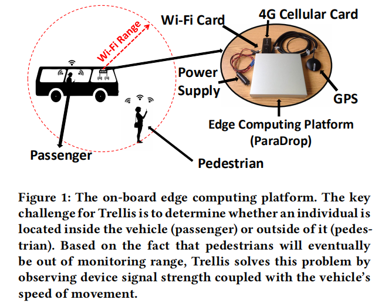

- 使用`ParaDrop`平台作为车辆的计算平台，更具灵活性和优势。`ParaDrop`平台在低端Wi-Fi接入点(AP)上实施，支持多租户和基于云的后端，通过这些后端可以在许多此类AP之间协调计算。`ParaDrop`还提供API，开发人员可以通过这些API跨多种`ParaDrop AP`管理他们的服务。
- 在这项工作中，我们将`ParaDrop AP`安装到公共交通工具中。通过将计算任务从云计算加载到`ParaDrop`，我们的系统可以在实现预期目标的同时实现更高的交通效率。
- 使用`ParaDrop`，可以快速导出各种相关的运输分析，并将其发送回运输运营商，而不会产生车辆的高数据要求。此外，使用`ParaDrop`可以轻松地在整个城市的多个车辆中部署和管理此类应用程序。

## 3.Trellis
`Trellis`提供了一种独特的方法来实时收集过境信息，并且可能与其他现有或互补的方法相结合。总的来说，Trellis提供了在人类大规模流动方面的一个新的视角
 - 前提: 每个设备都是开着WiFi功能的，这样可以被另一个WiFi设备跟踪。
 - 使用安装在车辆上的低端WiFi监控单元来区分乘客和行人，并且可以获得一个乘客何时上下车。

**考虑如下问题？**
 1. 乘客的乘车习惯，比如，起始-目的站的流行程度，对于不同的位置，不同的时间，这些热门站点是如何变化的。
 2. 研究城市街道乘客的模式，比如哪一条街道比较繁忙，不同时间不同季节的热点地区
 3. 天气因素对人类活动的影响

**如何区分行人和乘客？**

- 在Trellis中进行区分的方法非常简单——当车辆运动时，车载Wi-Fi观察者所感知的乘客Wi-Fi设备的信号强度相当稳定; 而外部行人的信号强度在最终消失之前会以可预测的趋势变化(如下图2)。在车辆运动时观察Wi-Fi设备的`信号强度趋势`可判断是乘客还是行人。
- 分两步实现这一目标
  1. 捕获Wi-Fi传输信号来执行设备检测任务。只要打开其Wi-Fi功能，设备就会发出探测请求包，扫描可用的接入点。系统利用此功能捕获启用Wi-Fi的设备，并通过检查MAC地址来区分设备
  2. 通过观察`RSSI`和`车辆的运动速度`来确定设备的位置。

完成这两个步骤后，系统会将设备数据记录到数据库中。
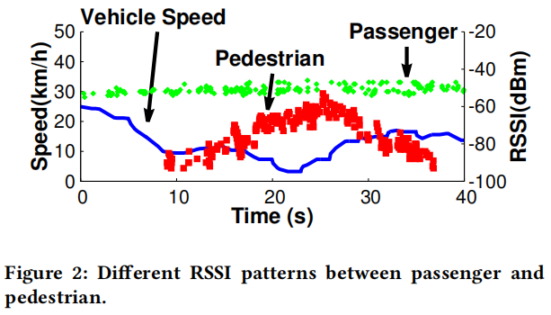

### 3.1 系统设计

- 我们的系统使用`前端监控模块`收集Wi-Fi设备的信号并传输GPS信息，并使用`后端处理模块`重建传输时间表和人员移动模式。
- `监控模块`执行嗅探任务并从移动设备收集数据。收集的数据将与相应的GPS位置信息一起保存在本地数据库中
- `扫描模块`可以通过蜂窝链路实时地将乘客和行人的数量发送到远程服务器，实现实时监控
- 虽然我们的系统支持实时通信，但我们使用单独的程序将数据从数据库发送到远程后端服务器。后端服务器根据收集的数据重建公共交通时刻表和人员移动模式。它进一步组合了来自多个传输嗅探系统实例的数据，以提供更完整的传输时间表和人员移动模式视图。在抽象和聚合模块之上，我们构建了一个起始——目的地矩阵和行人流热图，以分析空间和时间域中的传输效率。

**Trellis系统架构**
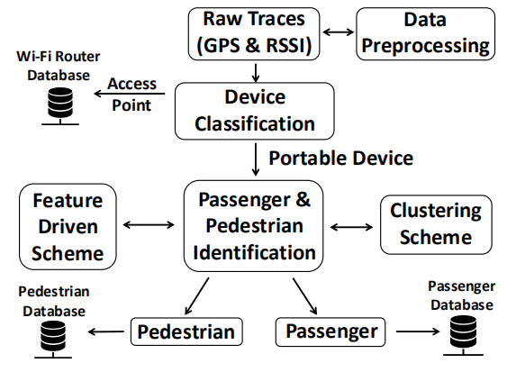

我们开发了两种方案，`Feature Driven Scheme`和`Clustering Scheme`，以确定一个用户是否在公共汽车上。
`Feature Driven Scheme`是一种直接的识别机制。我们在 RSSI 上设置了不同的阈值，距离和持续时间，以确定谁在公交车内。但是，很难选择一组可以在不同情况下工作的阈值。我们不能单独使用RSSI作为识别一名乘客是否在公交车上的指标。因此，我们从GPS和RSSI数据中提取特征，然后使用`分层聚类算法`来区分乘客和行人。

> 影响因素：
> - 每个用户不止一部智能手机或者可以连接Wi-Fi的设备
> - 用户可能为了省电没有开Wi-Fi

>在上述情况下，我们可能会高估或者低估用户数，但是我们研究的是人类活动的统计趋势，并不是乘客或者行人的精确数量。从长远来看，我们通过收集足够的信息仍然能够有效地跟踪运输行为的一般趋势。

上述架构设计的流程是：
预处理后的数据经过`GPS`和`RSSI`提取特征后，通过设备分类器可知道是WiFi接入点还是用户的移动设备，若是移动设备，那么再次经过分层聚类算法之后识别出是行人还是乘客，分别存入相应的数据库以作后续处理。（具体判断行人还是乘客的过程请看后面乘客检测和行人检测）

**接下来，我们将解释说明上述两种方案，以及如何跟踪每名乘客?**
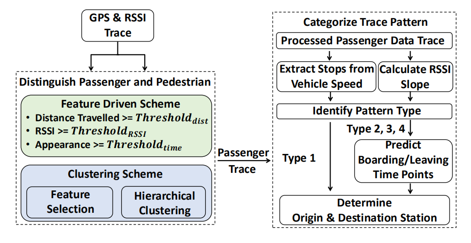
> 可结合3.3和3.4来看，区分乘客和行人
> 行人的检测比较简单，`Feature Driven Scheme`中三条语句结合分层聚类算法可判别是否为行人。
> 乘客跟踪，请看右侧流程。`Extract Stops From Vehicle Speed`可分析出公交站点；`Calculate RSSI Slope`检测乘客使用的移动设备的信号强度，`Identify Pattern Type`判断出四种类型的情况。类型1是理想情况下得到的数据可以得到乘客的原站和目的站，对于2、3、4我们需要预测原站或者目的站。最终，我们可知乘客的原站和目的站。

### 3.2 系统部署
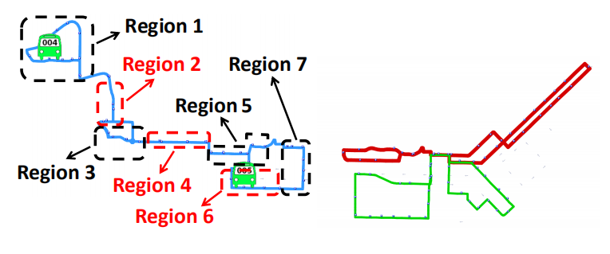

>一共三条公交路线，左边蓝色线路是80号公交线，右边红色线路是81号公交线，绿色是82号公交线
>为了便于分析，将80号公交线分为7个区域，其中1号区域是住宅区，5号是大学城

每条路线的详细情况见表1
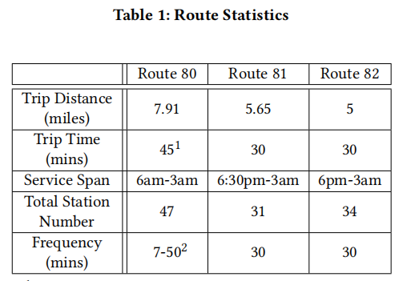

**那么我们的问题是如何去重构这些公交运行时刻表已更好的服务于乘客的出行？**
在整个数据收集过程中，三条公交路线的工作时间和距离如下:
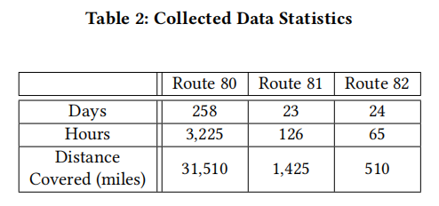

### 3.3 乘客跟踪
每个站点之间都有一段距离，理想情况下，我们可以观察到RSSI值的增加趋势，这表明乘客上了公共汽车。然后RSSI读数在一段时间内保持稳定，之后当乘客到达站点下车后信号强度下降。
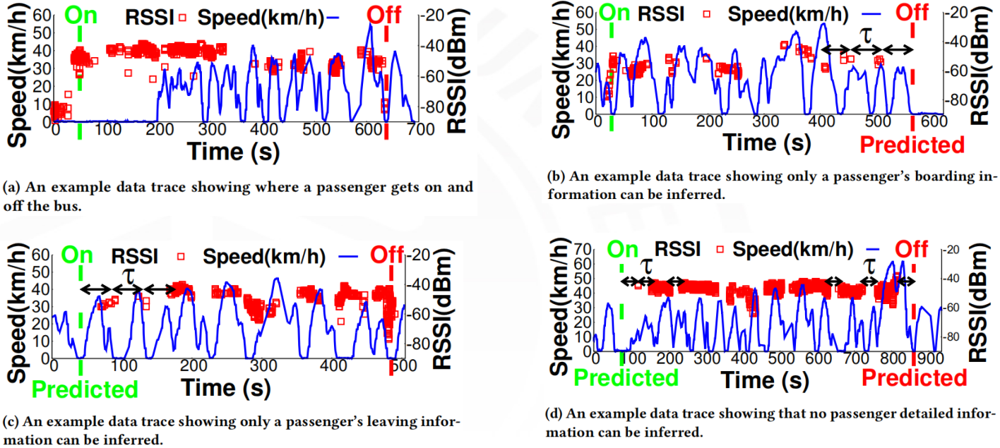
基于观察，RSSI和速度模式可分为四种类型。
类型1：理想的RSSI和速度模式，乘客上下车的地点和时间可以清楚地识别出来。（图a）
类型2：只能推断出上车信息。（图b）
类型3：只能推断出下车信息。（图c）
类型4：无法推断上下车信息。（图d）
对于类型2,3和4的模式，很难推断上下车信息。已经开发了一种预测方法来处理上述不完美的情况。（图d）

通过对RSSI求斜率(slope)可以直观地反映公交停靠点和乘客上下车点：

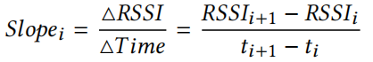

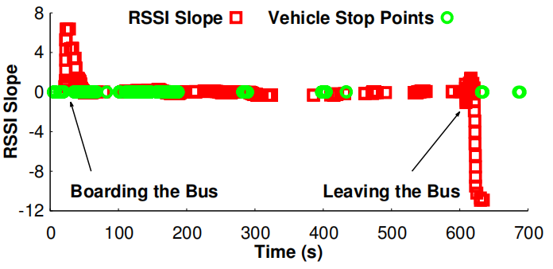

>理想的情况下，坡度值应该是正数，表示乘客上了公共汽车；坡度值是负值表示乘客下车了。斜率接近于0表示乘客在公共汽车上。根据车速可以提取出站点。然后，结合车辆停车点和RSSI的坡度信息，可以推断出乘客登车和下车点。

**Trellis为什么无法识别2型，3型和4型?**
当手机屏幕关闭时，系统会降低发送探测请求包的频率以节省电量。理论上，设备应该每隔τ秒发出一次探测请求，这意味着我们每τ秒至少可以检测一次该设备。乘客有可能在这个τ时间内上下车，这就是为什么

**如何解决？**
为了处理这些情况，我们开发了一个模型来预测乘客何时上下车。首先，基于来自该特定设备的接收分组的频率（注意，不同品牌的手机发送的频率不同），我们使用下式估计τ：
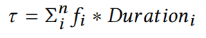
其中，持续时间i是第i个和第(i + 1)个数据包之间的时间差，而fi是持续时间i的出现频率
向前退一个τ可得乘客上车点，向后一个τ可得乘客下车点。

### 3.4 行人检测
只要在公交路线上的行人都可以被检测到。文中使用的`行人检测算法`：首先检查公交车行驶的总距离。如果行程距离小于距离阈值βoff，则它将检查RSSI读数。与乘客RSSI读数相反，α读数的一部分应小于阈值δon。 如果满足上述两个条件，则很有可能是行人。
CDF：累积分布函数
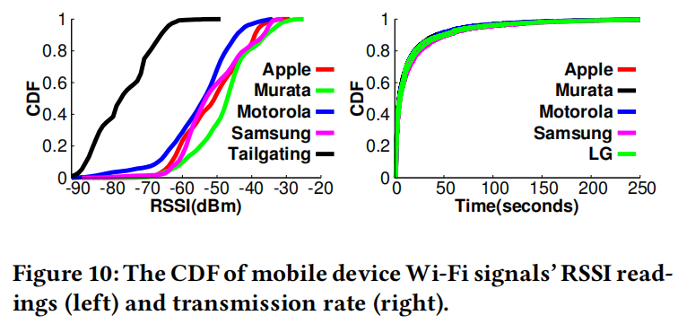

### 3.5 乘客活动分析
#### 3.5.1 公交车占用情况
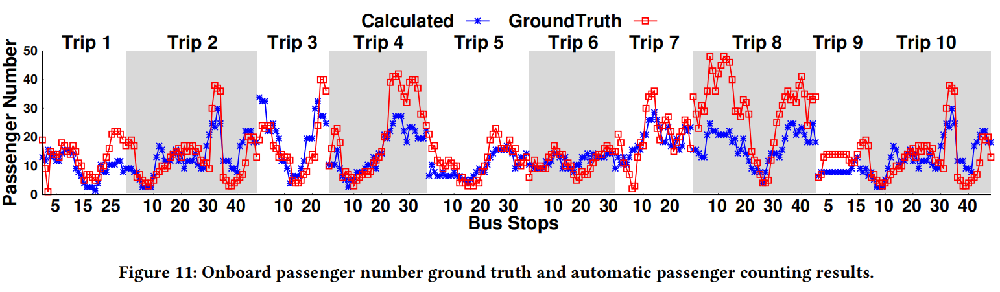

> - x轴表示为该次旅行计算的公交站数；y轴表示公共汽车上连续两个公交站之间的乘客数。
- 每一个红点代表巴士在该巴士站的实际乘客人数。
- 现有乘客离开公交车和新乘客上车后，在公交车停靠站时都统计了真实的乘客人数。

#### 3.5.2 交通骑行模式

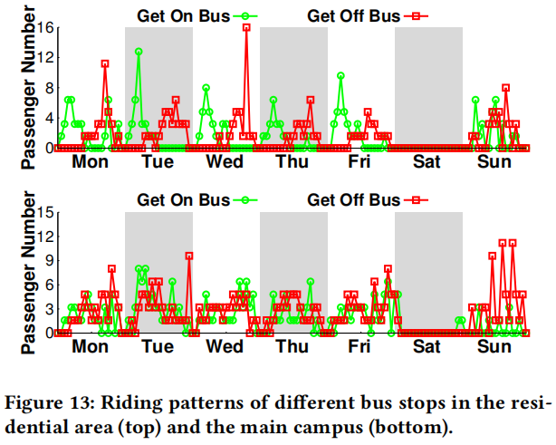

从这两个图中产生了两个主要观察结果：

- 首先，相同的骑行模式（包括上车和下车）会在周一到周五重复，并在周末进行更改。
- 其次，位于不同地区的公交车站有不同的骑行模式。例如，在住宅区，人们早上外出工作，下午晚些时候回家。因此，在那些时间里有明显的骑行高峰。 此外，本科学生住在校园里。他们在宿舍和校园建筑物之间来回，全天都有不同的班级，因此乘客上下车的次数达到顶峰。

#### 3.5.3 公交计划分析
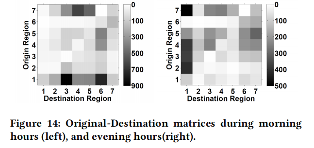

>黑色越深，表示人数越多。从上述图中我们可以看出原站->目的站之间的客流量。白天的时候1号住宅区的人乘客到3号和6号区域比较多；7号到4号区域也达到顶峰。晚上，7、4、3、2去往1号区域的比较多。

### 3.6 行人活动分析
行人活动对公共交通的设计和评估都非常重要。传统的公交评估方法缺乏收集行人信息的方法。我们的系统带来了使用人员移动模式评估交通系统的可能性。行人流已被证明与交通流量密切相关，即行人流可以反映并且影响交通状况。检测行人活动可以帮助中转站经营者更好地了解铁路运输条件。
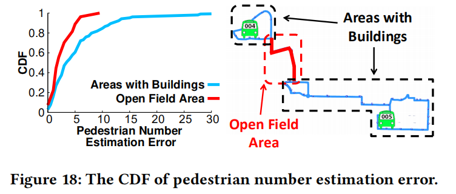

>在空旷的区域误差相对较小，由于在行人检测的时候，可能会将附近建筑物中的人检测进去，因而会带来一定的误差。

**下图为行人热量图：**
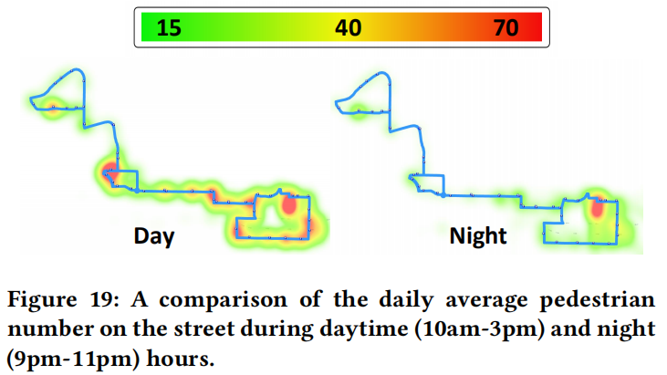

>从上述图，我们可以了解到时间因素的影响。在一天的不同时间，行人的活动是不一样的。当然根据不同的地区会有不同的行人热量图。

## “I want to say”
- 找的是边缘计算的文章，但本文讲的内容虽然用到了先前比较成熟的边缘计算平台——paradrop,但还是属于在边缘计算平台上的一个实际应用。边缘计算的提出最大的目的还是为了减小延迟问题。文章基于公交车运营管理为背景，通过收集大量的数据分析乘客和行人的客流量，及人们的出行方式等，为运输运营商和潜在的城市规划者提供有用的分析。
- 整体看下来没有讲具体的算法，对于Trellis的架构和平台的运行方式做了详细的讲解。
- 这篇文章中几个图形画的很不错！不同需求使用不同模式的图，非常直观明了！
- 之后在这方面还会看一些文章，不过我还是更加倾向于看具体的某种算法。当然，这篇发表于顶级会议的文章还是非常具有学习价值的啦~

完结撒花blingbling^^

