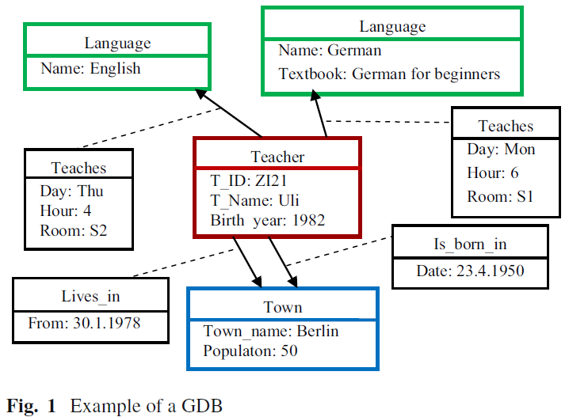
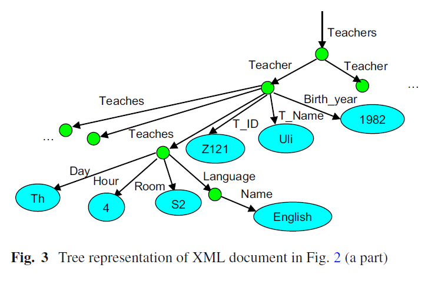

本文是关于图数据库中function query的介绍。[原文链接](http://xueshu.baidu.com/s?wd=paperuri%3A%2871b13f3c262bfdfaee964860c11726b8%29&filter=sc_long_sign&tn=SE_xueshusource_2kduw22v&sc_vurl=http%3A%2F%2Flink.springer.com%2Fcontent%2Fpdf%2F10.1007%252Fs40595-017-0104-6.pdf&ie=utf-8&sc_us=4825947526401823823)

<!--more-->
---
@Author: Jaroslav Pokorný
@Publiced in: Asian Conference on Intelligent Information & D... , 2017 :291-301
@Presented by: Yina Lv
@Action: October 16, 2018 7:10 PM

---

## 写在文前
今天找了好多关于图数据库的文章，全网搜！2018年发表找不到的发邮件给笔者，凭着试试的心态，居然辣么快回复我了，好激动啊！！真是非常感谢那位作者呢~当然下面要讲的这篇文章是非常顺利找到的啦^ ^

## 碎碎念
- 目前，在属性图数据库中最著名的声明性查询语言是Cypher，被用于neo4j的图数据库管理系统(GDBMS)中
- Cypher是第一个针对属性图数据模型的模式匹配查询语言，Cypher命令使用了部分的SQL语法
- 我们研究图数据库，当然使用的模型是一个图啦

**关于Gremlin**

- 一种由Apache TinkerPop开发的功能图查询语言，它允许在属性图上表示复杂的图遍历和变异操作
- 遍历操作/函数被链接在一起形成类似路径的表达式
- GDBMS大多支持Gremlin(例如Titan)

## Schema

- 本文考虑了`labelled property graph model`，并提到了XML数据库背后的图模型。
- 从概念和数据两方面对图数据库的功能建模进行了研究，考虑了graph conceptual schema and graph database schema以及类型化属性在概念和数据库级别都用作基本结构。
- 作为声明图数据库的正式方法，使用查询类型的lambda演算的版本。这种方法允许使用查询，算术和聚合函数(aggregation function)所必需的逻辑。另外，能够在一个集成环境中处理关系和图形的能力。

## 1.Introduction
### 1.1 Property Graph

关于`Property Graph`的一些要点（可以参考之前的博文[第三章](https://www.elainelv.top/2018/10/11/Cypher/#more)）：
 - 一个图中的节点和边可以有无数个，每个节点和边可以有多个labels
 - 每条边连接两个节点
 - 每个节点和边都有唯一的标识符
 - 属性表示形式 `key:value`

### 1.2 XML graphs

未完待续………

