本系列博文是听了课程[Linux达人养成计划I](https://www.imooc.com/video/3235)后的个人学习笔记整理，较为详细，供大家学习参考。
<!--more-->

# 第1章 Linux简介
## 1.1Linux发展史
  > Unix——Minix——Linux
    
 - 内核版本
Linux内核官网：www.kernel.org
内核版本说明：2.6.18（主版本.次版本.末版本）
目前最新的内核版本:3.16
 - 发行版本
主要的发行版本：`debian`、`Ubuntu`（图形界面）、`redhat`（用的最多）、`CentOS`（服务器）、`fedora`（redhat的个人版）等
不同的版本使用的内核基本是一致的，主要是版本不同。其中，`CentOS`和`redhat`完全一样，但`CentOS`完全免费，而`redhat`是收费的。


## 1.2 开源软件简介
Linux最大的特点就是它是开源软件，所谓开源软件是呈现出来的源代码，不是二进制，而是完全英文。

- 常用的开源软件（**开源≠免费**）：
`Apache`：网站搭建软件，可发布已写好的网站到互联网。
`nginx`：占用资源少，提供更多的访问量
`linux`、`PHP`、`MySQL`
`monggoDB`、`sumba`、`ruby`、`Python`（脚本语言）

- 开源软件的优点：
  1.使用自由：绝大多数的开源软件免费
  2.研究的自由：可以获得软件源代码
  3.散步及改良自由：可以自由传播、改良及销售


## 1.3 Linux应用领域
- 基于Linux的应用服务器
查看现在互联网发展报告和各个网站的详细信息：[Go](https://www.netcraft.com/)
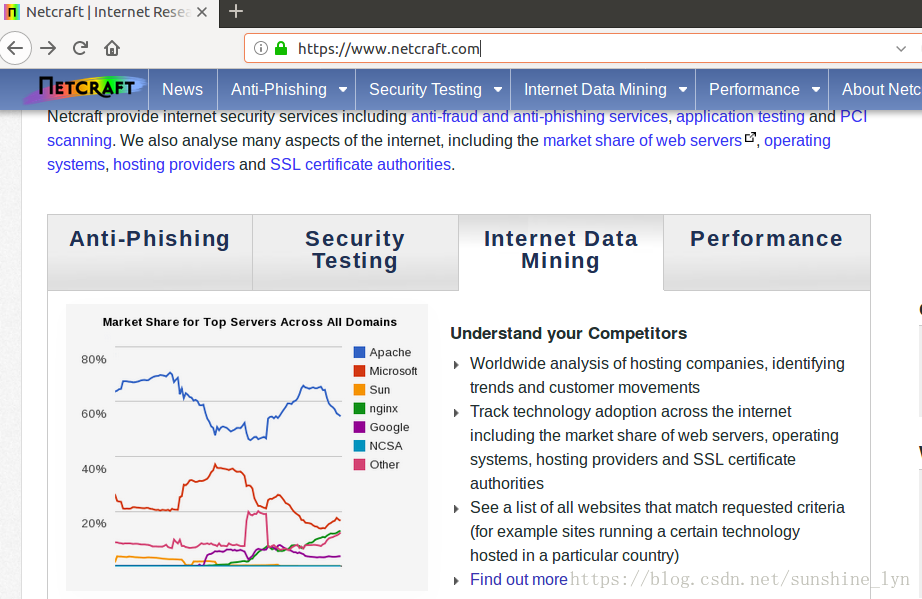


- 嵌入式应用
远程管理ssh，手机与Linux之间远程管理。在手机上安装ssh应用（`QuickSSHd`），使用`SecureCRT`应用连接手机。我的手机是iOS系统，在APP商城找的一个评分比较高的ssh应用，叫做`Termius`，非常好用！需要注意的是安卓系统的底层是Linux，而苹果iOS系统的底层是Unix。
## 1.4 Linux与Windows的不同
1. Linux严格区分大小写
2. Linux中所有的内容均以文件形式保存，包括硬件、用户等
3. Linux不靠扩展名来区分文件类型，它仅靠权限来区分文件
4. Windows下的程序不能直接在Linux下安装和运行
5. Linux不靠扩展名来区分文件类型
## 1.5 字符界面的优势
- **优势一**：`字符界面占用的系统资源更少`。字符界面远比图形界面占用的资源要少得多，图形界面需要服务器来分担更多的系统资源，无论是CPU、内存占有还是运行空间等，从而会拿出更少的资源供客户端访问。
- **优势二**：正因为其占用的资源更少，所以字符界面`减少了错误的可能性和被攻击的可能性`。

Windows主要针对个人用户，所以重视应用性、可操作性；而Linux主要针对服务器操作人员，所以更为注重稳定性和安全性。

# 第2章 Linux分区与安装
## 2.1系统分区
1、分区：把大硬盘分为小的逻辑分区
逻辑分区一定是从5开始的，1-4是给主分区的。
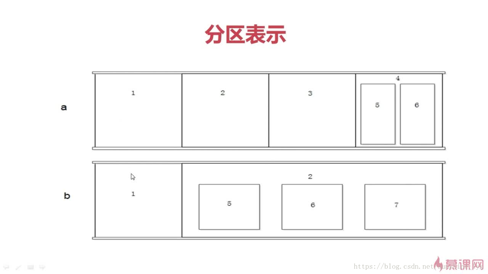
2、格式化：写入文件系统
3、分区设备文件名：给每个分区定义设备文件名
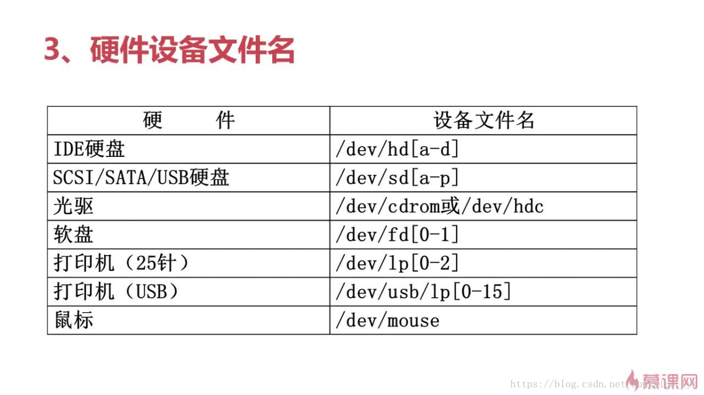
4、挂载
把盘符和分区连接在一起的过程称作挂载，把目录（也就是Windows下所说的盘符）称作挂载点

- 必须分区
 - / 根分区
 - swap分区：交换分区，也就是虚拟内存，建议分内存的2倍，但实际内存超过4G，和实际内存一样大即可
 - 推荐分区
 - /boot ：启动分区，200M

## 2.2 Linux安装


我安装的是Ubuntu16.04，首先是制作U盘启动盘，使用universal USB Installer工具，然后从官网下载映像文件。可参考此博文[简单的使用Universal_USB_Installer_1.9.7.7安装系统](https://blog.csdn.net/qq_37657081/article/details/78533164)

# 第3章 命令基本格式及文件处理命令

## 3.1 Linux命令格式
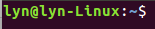
上述是我Ubuntu终端，lyn是用户名，lyn-Linux是我的主机名，～表示根目录，也就是当前所在根目录下，表示超级用户，$表示普通用户
在课程中，使用的环境是VM虚拟机+CentOS操作系统。

- **命令 [选项] [参数]**
注意：个别的命令使用不遵循此格式；当有多个选项时，可以写在一起；简化选项与完整选项 -a 等同于--all
- **查询目录中的内容：ls [选项] [文件或目录]**
ls -l  (别名为ll) 可查看详细信息
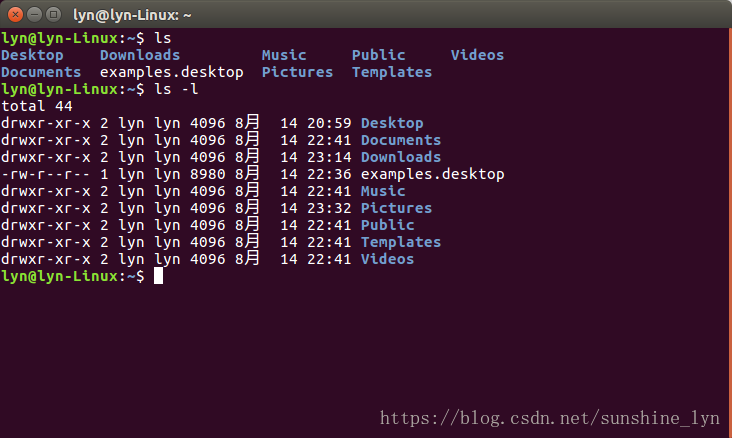
-rw-r--r--
第一个字符表示文件类型（-文件，d目录，l软链接文件），后面9个字符，每3个为一组，分别表示u所有者、g所属组、o其他人的权限问题。
**三种权限：** `r` 是否可读，`w` 是否可写，`x` 是否为可执行。
>**ls中的其他选项:**
`-a `显示所有文件，包括隐藏文件
`-d` 查看目录属性
`-h` 人性化显示文件大小
`-i` 显示inode，即文件的id

## 3.2 文件处理命令

### 3.2.1目录处理命令
- **mkdir  -p  [目录名]**
建立目录(make directories)，其中，`-p`表示递归创建
- **cd [目录]**
切换所在目录(change directory)
>`cd ~` 进入当前用户的家目录
`cd  `   进入家目录
`cd -` 进入上次目录
`cd ..` 进入上一级目录
`cd .` 进入当前目录

- **pwd**
查询所在目录位置(print work directory)
- **rmdir**
删除空目录(remove empty directory)
- **rm  -rf  [文件或目录]**
删除文件或目录(remove)，-r  删除目录     -f 强制
- **cp**
复制命令(copy)
>选项：
`-r` 复制目录
`-p`  连带文件属性复制
`-d`若源文件是链接文件，则复制链接属性
`-a` 相当于 -pdr   目标文件和源文件就会一模一样！
- **mv  [原文件或目录]  [目标目录]**
剪切或改名命令(move)，不需要加-r


### 3.2.2 Linux常见目录作用
  
> `/bin ` 用于保存命令的目录（普通用户就可以读取）
 `/sbin` 用于保存命令的目录（只有root能用）
`/usr/bin` 用于保存命令的目录
`/usr/sbin` 用于保存命令的目录（只有root能用）
`/boot`启动目录，系统启动的文件都放这里，一般不动该目录
`/dev` 该目录下存放的都是设备相关的文件，一般也不要去动
`/etc` 主要存放配置文件的目录
`/home` 是普通用户目录 (普通用户对应目录下可以随便放文件)
`/root` 是超级用户目录（root用户对应目录下可以随便放文件）
`/lib` 存放linux系统函数库
`/mnt `空目录，用于挂在外接存储设备
`/media` 空目录，用于挂在外接存储设备(在原来的linux系统中没有)
`/misc` 空目录，用于挂在外接存储设备(在原来的linux系统中没有)
`/proc` 是内存过载点；这两个目录的内容直接写在内存，因此不能直接操作
`/sys` 是内存过载点；这两个目录的内容直接写在内存，因此不能直接操作
`/temp ` 临时目录（随便放文件）
`/usr ` 系统软件资源目录
`/var` 系统相关文档内容

### 3.2.3 链接命令  ln
（1）ln [原文件] [目标文件]
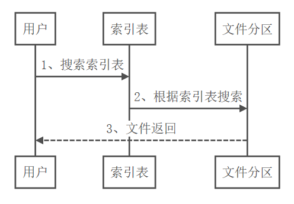
硬链接特征：

1. 拥有相同的i节点和存储block，对应到的目标文件都是同一个
2. 可通过i节点识别
3. 不能跨分区；
4. 不能针对目录；

（2）ln -s  [原文件]  [目标文件]

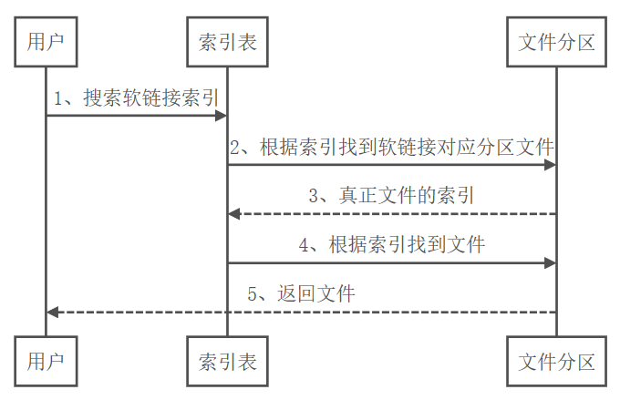

这里需要注意的是第二步，目标文件中存的是原文件的文件信息，而不是其内容，所以需要先找到原文件，通过原文件中存放的信息索引真正的文件数据。

软链接的特征：

1. 类似于Windows快捷方式；
2. 软链接拥有自己的I节点和Block块，但是数据块中只保存原文件的文件名和I节点号，并没有实际的文件数据；
3. lrwxrwxrwx 软链接文件的`权限都是rwxrwxrwx`
4. 修改任意文件，另一个都改变
5. 删除原文件，软链接不能使用
6. 做软链接，修改原文件`一定要写绝对路径`，否则会报错；硬链接没有这个要求

虽然创建软链接后，文件类型是l，文件权限是777，但还是要根据原先文件的权限来的。
推荐大家使用软链接。


**总结**：

- `硬链接`指的是原文件和目标文件访问和搜索的是同一个i节点，然后搜索的数据是同一个block。所以删除任何一个都可以正常使用。修改任何一个，另外一个也会跟着变化。但是它不能跨分区、不能链接目录，只能通过i节点来判断是否是硬链接。
- `软链接`完全跟Windows下的快捷方式一样，创建软链接时，它会自动创建inode和block。block中保存的是原文件的信息，这时候修改两个文件中任何一个文件，两个文件都会变，删除原文件，软链接也就不能使用了。

# 第4章 文件搜索命令

## 4.1文件搜索命令locate
- locate 文件名

> - 在后台数据库中按文件名搜索，搜索速度更快
- 所搜索的后台数据库为 /var/lib/mlocate
- updatedb 更新数据库(正常情况下数据库一天更新一次)

配置文件：`/etc/updatedb.conf ` ，在locate中，是按照上述配置文件来搜索的。

>`PRUNE_BIND_MOUNTS="yes"`      开启搜索限制
`PRUNEFS=`     搜索时，不搜索的文件系统
`PRUNENAMES= `   搜索时，不搜索的文件类型
`PRUNEPATHS= `    搜索时，不搜索的路径

## 4.2 命令搜索命令
- whereis  命令名
例如：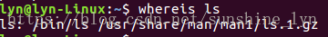
搜索命令所在的路径及帮助文档所在位置
不能操作linux自带的shell命令，如 cd
>选项：
`-b` 只查找可执行文件
`-m` 只查找帮助文档

- which 命令
例如：
能查看命令的可执行文件路径以及别名
不能操作linux自带的shell命令，如 cd
- echo $PATH
环境变量都用:分隔
PATH定义系统搜索命令的路径（或绝对路径执行）
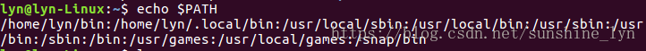

## 4.3 文件搜索命令find
可以看出，以上locate、whereis、which 比较局限。locate用来搜索文件， whereis 和 which 用来搜索系统命令。那么find的功能非常的强大，下面我们来详细学习。


- find [搜索范围] [搜索条件]
find / - name install.log 从根目录开始，搜索文件名为install.log的文件
尽可能避免大范围搜索，会非常消耗系统资源

 > - 可以使用的通配符
`* `匹配任意内容
`?` 匹配任意一个字符
`[] `匹配任意一个中括号内的字符

>`-iname` 不区分大小写
`-user` 按照所有者搜索
`-nouser `查找所有没有所有者的文件

内核产生的文件可能没有所有者，外来文件可能没有所有者。剩下的Linux中的所有文件都应该有所有者！

- 根据时间查找
>`-mtime +10` 查找10天之前的修改文件（也可以是创建时间）
`-mtime 10` 查找10天前当天的修改文件
`-mtime -10` 查找10天内的修改文件
`-atime` 天数 文件访问时间（天数同上）
`-ctime` 天数 改变文件属性时间（天数同上）

- 根据文件大小查找
>`-size +10k `查找大于10k的文件（小写k）
`-size 10M` 查找等于10M的文件（大写M）
`-size -10G `查找小于10G的文件（大写G）
`-size 10` 不加单位表示搜索10个扇区，一个扇区512B（不推荐使用）
 
- 根据i节点号查询
ls -i 可以查看i节点
-inum 262422 查找i节点是162422的文件
- 组合查询
`-a` 逻辑与
`-o `逻辑或
`-exec/-ok` 命令 {} \; 对搜索结果进行操作
例：
find /etc -size +20k -a -mtime -10 -exec ls -lh {} \;
查找大于20k并且在10天之内操作过的文件，将结果展示出来；

## 4.4 grep命令
- grep [选项] 字符串 文件名
在文件当中匹配符合条件的字符串

> 选项：
`-i `忽略大小写
`-v` 排除制定字符串

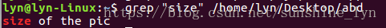
**与find命令的区别**

- find命令：在系统当中搜索符合条件的文件名，如果需要匹配，使用通配符能完全匹配
- grep命令：在文件当中搜索符合条件的字符串，如果需要匹配，使用正则表达式进行包含匹配。

# 第5章 帮助命令
- man 命令
获取制定命令的帮助,如：man ls
打开帮助文档之后，快速查找可以先输入 / ，再输入要查找的内容。查到之后 n表示 往下查找，p或shift + n 往上查找。

>man的级别
1：查看命令的帮助
2：查看可悲内核调用的函数的帮助
3：查看函数和函数库的帮助
4： 查看特殊文件的帮助（主要是/dev目录下的文件）
5：查看配置文件的帮助
6：查看游戏的帮助
7：查看其它杂项的帮助
8：查看系统管理员可用命令的帮助
9：查看内核相关文件的帮助


`man -f` 命令 等同于` whatis `命令， whatis 能查看命令拥有哪个级别的帮助。
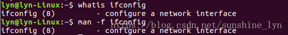

可以看出 ifconfig的级别是8，属于系统管理员可用命令。
man -k passwd 等同于 apropos passwd  `查看所有包含该命令的帮助文档 `，可认为在帮助文档中用`字符串`搜索。
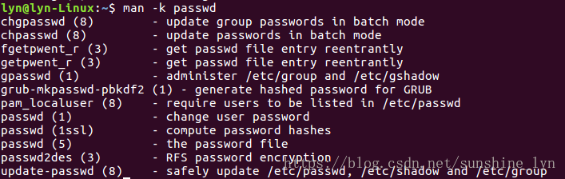

- 命令 --help
获取选项的帮助
- help 命令
help 专门获取内部命令，若help ls将报错，因为ls不是内部命令。
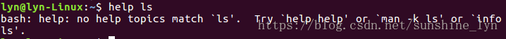

- info 命令
回车 进入子帮助页面（带有*号标记）
>`u` 进入上层页面
`n` 进入下一个帮助小节
`p `进入上一个帮助小节
`q` 退出


# 第6章 压缩命令
- 常用的压缩格式
.zip   .gz   .bz2
.tar.gz   .tar.bz2

- .zip格式压缩
zip 压缩文件名 源文件      # 压缩文件
zip -r 压缩文件名 源目录      # 压缩目录
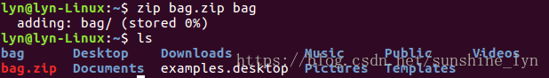
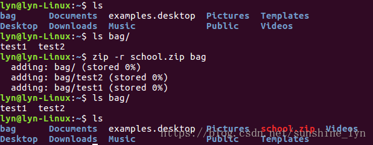

- .zip格式解压
unzip 压缩文件   #解压缩
- .gz格式压缩
gzip 源文件         #压缩为.gz格式的压缩文件，源文件会消失
gzip -c 源文件 > 压缩文件     # 压缩为.gz格式，源文件保留
gzip -r 目录              # 压缩目录下所有的子文件，但是不能压缩目录
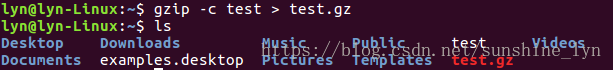
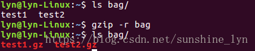
- .gz格式解压
gzip -d 压缩文件
gunzip 压缩文件
- .bz2格式压缩
bzip2 源文件 　　　　＃压缩为.bz2格式，不保留源文件
bzip2 -k 源文件 　   　＃压缩之后保留源文件
`注意：bzip2命令不能压缩目录`
- .bz2格式解压
bzip2 -d 压缩文件         # -k 选项可保留源文件
bunzip2 压缩文件     　 # -k 选项可保留源文件

针对上述bzip2不能压缩目录，可通过如下方式解决：

- 打包命令tar
tar -cvf 打包文件名 源文件
选项：
`-c `打包
`-v` 显示过程
`-f` 指定打包后的文件名
例：tar -cvf longzls.tar longzls
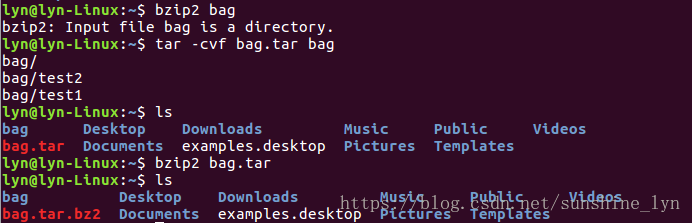
- 解打包命令tar
tar -xvf 打包文件名
选项：
`-x` 解打包
例：tar -xvf longzls.tar
- .tar.gz压缩格式
.tar.gz格式是先打包为.tar格式，再压缩为.gz格式
**压缩：**
tar -`zc`vf 压缩包名.tar.gz 源文件
**解压：**
tar -`zx`vf 压缩包名.tar.gz
只查看不解压：
tar -`zt`vf 压缩包名.tar.gz
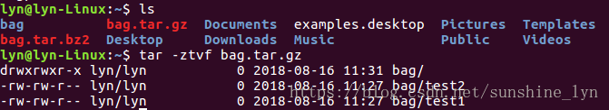
- .tar.bz2压缩格式
**压缩：**
tar -jcvf 压缩包名.tar.bz2 源文件
**解压：**
tar -jxvf 压缩包名.tar.bz2 源文件

# 第7章　关机和重启命令
- shutdown [选项] 时间 &
&表示后台执行
选项：
`-c `取消前一个关机命令
`-h` 关机
`-r `重启
例：shutdown -r 05:30 &　　＃5:30分重启
shutdown -r now   #立即重启
- 其他关机命令（以下三条命令都不是太安全，不常用也不建议用）
halt
poweroff
init 0
- 其他重启命令
reboot 相对较安全
init 6　　　＃尽量也别用，调用系统运行级别
- 系统运行级别
> 0 　关机
> 1 　单用户　　　（比如忘记密码了，可使用单用户修复）
> 2 　不完全多用户，不含NFS服务
> 3 　完全多用户　（字符界面）
> 4 　未分配
> 5 　图形界面
> 6 　重启

- cat /etc/inittab 查看运行级别配置文件
- id:3:initdefault 修改系统默认运行级别
- runlevel 查询系统运行级别
- logout 退出登录命令


# 第８章　其他常用命令
## 8.1 挂载命令
１、查询与自动挂载
`mount `　　＃查询系统中已经挂载好的设备
`mount -a`     # 依据配置文件/etc/fstab的内容，自动挂载
注：因为光盘或U盘不能保证每次都能开机挂载，因此不建议自动挂载，否则可能导致系统由于找不到挂载目录而启动崩溃

2、挂载命令格式
mount [-t 文件系统] [-o 特殊选项] 设备文件名 挂载点
选项：
`-t` 文件系统：加入文件系统类型来指定挂载的类型，可以ext3、ext4、iso9660（光盘默认的文件系统）等文件系统
`-o `特殊选项：可以指定挂载的额外选项

系统中的特殊权限：

 参数 | 说明
-----|-------
atime/noatime | 更新访问时间/不更新访问时间。访问分区文件时，是否更新文件的访问时间，默认为更新
async/sync | 异步/同步，默认为异步
auto/noauto | 自动/手动，mount -a命令执行时，是否会自动安装/etc/fstab文件内容挂载，默认为自动
defaults |定义默认值，相当于rw,suid,dev,exec,auto,nouser,async这七个选项
exec/noexec|执行/不执行，设定是否允许在文件系统中执行可执行文件，默认是exec允许
remount|重新挂载已经挂载的文件系统，一般用于指定修改特殊权限
rw/ro|读写/只读,文件系统挂载时，是否具有读写权限，默认是rw
suid/nosuid|具有/不具有SUID权限，设定文件系统是否具有SUID和SGID的权限，默认是具有
user/nouser|允许/不允许普通用户挂载，设定文件系统是否允许普通用户挂载，默认是不允许，只有root可以挂载分区
usrquota|写入代表文件系统支持用户磁盘配额，默认不支持
grpquota|写入代表文件系统支持组磁盘配额，默认不支持

例:
```
mount -o remount,`noexec` /home/   #重新挂载/boot分区，并使用noexec权限，会导致/home目录下无法执行可执行文件
mount -o remount,`exec` /home      #记得改回来！！！不然会影响系统启动
```
整个示例语句如下：
```bash
mount -o remount,noexec /home
cd /home
vi hello.sh
cdmod 755 hello.sh
./hello    #采用./的形式来运行hello文件
mount -o remount,exec /home
```
３、如何挂载光盘（光盘默认是没有挂载的）

- 挂载命令
```bash
mkdir /mnt/cdrom/　　　　#建立挂载点
mount -t iso9660 /dev/cdrom /mnt/cdrom   #挂载光盘
mount /dev/sr0 /mnt/cdrom       #sr0是Linux指定的CD目录,和上一条命令功能一样
```
- 卸载命令（不要忘记！用完之后必须卸载！）
```bash
umount 设备文件名或挂载点　#要拿出光盘，必须卸载，且需要退出光盘文件目录后再执行以上命令。
```
例:umount /mnt/cdrom　等同于　umount /dev/sr0  ，因为已经挂载好了，但注意只能卸载一次。

４、挂载U盘
```bash
fdisk -l   #查看U盘设备文件名
mount -t vfat /dev/sdb1 /mnt/usb/    #Linux默认不支持NTFS文件系统，此处的vfat指的是Windows中的fat32，fat32在硬盘中基本淘汰,而Ｕ盘用的是fat32。
```

## 8.2 用户登录查看命令
- **查看登录用户信息**
 - w 用户名
命令输出：
USER ：登录的用户名
TTY ：登录终端
FROM ：从哪个IP地址登录
LOGIN@ ： 登录时间
IDLE ：用户闲置时间
JCPU： 指的是和该终端连接的所有进程占用的时间。这个时间里并不包括过去的后台作业时间，但却包括当前正在运行的后台作业所占用的时间；
PCPU ：是指当前进程所占用的时间
WHAT ： 当前正在运行的命令
 - who 用户名
命令输出 ：
用户名
登录终端
登录时间（登录来源IP地址）


- **查询当前登录和过去登录的用户信息**
 - last
last 命令默认是读取/var/log/wtmp文件数据
命令输出：
用户名
登录终端
登录IP
登录时间
退出时间（在线时间）
- **查看所有用户的最后一次登录时间**
 - lastlog
lastlog 命令默认读取/var/log/lastlog文件内容
命令输出：
用户名
登录终端
登录IP
最后一次登录时间

# 第9章 shell基础
## 9.1 shell概述
**shell 是什么?**

- shell是一个`命令行解释器`，它为用户提供了一个向Linux内核发送请求以便运行程序的界面系统级程序，用户可以用shell来启动，挂起，停止甚至是编写一些程序。
- shell还是一个功能相当强大的编程语言，易编写，易调试，灵活性较强。shell是解释执行的脚本语言，在shell中可以直接调用Linux系统命令。

通俗地讲，shell充当用户和内核之间的翻译器。

**shell分类**
shell的两种主要语法类型是`Bourne `和` C`，这两种语法彼此不兼容。
`Bourne Shell`：sh、ksh、Bash、psh、zsh
`C Shell`：csh、tcsh，C Shell主要在BSD版的Unix中使用，其语法和C语言类似而得名。
当前linux中的标准shell是`Bash`
	

```bash
echo $SHELL    # 查看当前shell
vi /etc/shells  #查看支持的shell类型
```


## 9.2 脚本执行方式
**1、echo输出命令**
echo [选项] [输出内容]
选项：
`-e `支持反斜线控制的字符转换

控制字符|作 用
----|-------
\a|输出警告音
\b|退格键，也就是向左删除键
\n|换行符
\r|回车键
\t|制表符，也就是Tab键
\v|垂直制表符
\0nnn|按照八进制ASCII码表输出字符。其中0为数字零，nnn是三位八进制数
\xhh|按照十六进制ASCII码表输出字符。其中hh是两位十六进制数

常规用法 :
echo -e "h\te\tl\nl\to\t"
echo -e \ "\x68\t\x\65\t\x\6c\n\x\6c\t\x6f\t"

**2、echo输出颜色**
echo -e "\e[1;31m 嫁人就要嫁凤姐 \e[0m"
\e[1;31m   #开启颜色显示
\e[0m    #取消颜色显示
>30m=黑色,31m=红色,32m=绿色,33m=黄色
34m=蓝色,35m=洋红,36m=青色,37m=白色

**3、第一个脚本**
vi hello.sh

```bash
#!/bin/bash
echo -e "\e[1;34m hello world! \e[0m"
```

**脚本执行方法：**

- 方法一：赋予执行权限，直接执行
chmod 755 hello.sh
- 方法二：通过Bash调用的执行脚本
bash helloworld.sh

## 9.3 Bash的基本功能
### 9.3.1 命令别名与快捷键
- 别名永久生效与删除别名

```bash
vi ~/.bashrc        #写入环境变量配置文件
source .bashrc      # 环境变量直接生效
```

- 查看与设定别名

```bash
alias                   # 查看系统中所有的命令别名
alias 别名= '原命令'      # 设定命令别名
unalias 别名             # 删除别名
```

- 命令生效顺序
1.执行用绝对路径或相对路径执行的命令
2.执行别名
3.执行 Bash 的内部命令
4.执行按照 $PATH 环境变量定义的目录查找顺序找到第一个命令
- 常用快捷键(非常有用，记住！！）
`ctrl+c `强制终止当前命令
`ctrl+l` 清屏 同命令clear
`ctrl+a `光标移动到命令行首
`ctrl+e` 光标移动到命令行尾
`ctrl+u `从光标所在位置删除到首行
`ctrl+z `把命令放入后台
`ctrl+r `在历史命令中搜索 上下滚动

### 9.3.2 历史命令
 - 历史命令
history [选项] [历史命令保存文件]
选项：
`-c` 清空历史命令
`-w `把缓存中的历史命令写入历史命令保存文件 ~/.bash_history
/etc/profile  HISTSIZE属性可设置保存历史命令条数，默认1000条
 - 历史命令的调用
↑↓ 调用以前的历史命令（常用）
!n 重复执行第n条历史命令
!! 重复执行上一条命令
!字符串 重复执行最后一条以该字符串开头的命令（常用）

### 9.3.3 输出重定向
 - 标准输入输出
 
设备|设备文件名|文件描述符|类型
------|---------|-------|-------
键盘|/dev/stdin|0|标准输入
显示器|/dev/sdtout|1|标准输出
显示器|/dev/sdterr|2|标准错误输出


 - 输出重定向

类型|符号|作用
------|------|--------
标准输出重定向|命令>文件|以覆盖的方式，把命令的正确输出到制定的文件或设备当中
标准输出重定向|命令>>文件|以追加的方式，把命令的正确输出到制定的文件或设备当中
标准错误输出重定向|命令2>文件|以覆盖的方式，把命令的错误输出到制定的文件或设备当中
标准错误输出重定向|命令2>>文件|以追加的方式，把命令的错误输出到制定的文件或设备当中


- 正确输出和错误输出同时保存

符号|作用
---|---------
命令>文件 2>&1|以覆盖的方式，把正确输出和错误输出都保存到一个文件当中
命令>>文件 2>&1|以追加的方式，把正确输出和错误输出都保存到一个文件当中
命令 &> 文件|以覆盖的方式，把正确输出和错误输出都保存在同一个文件当中
命令 &>> 文件|以追加的方式，把正确输出和错误输出都保存在同一个文件当中
命令>>文件1 2>>文件2|把正确的输出追加到文件1中，吧错误的输出追加到文件2中
ls &>/dev/null把输出结果直接丢了


- 输入重定向
wc 直接输入字符 ctrl + d 停止输入
wc [选项][文件名]
`-c` 统计字节数
`-w` 共计单词书
`-l` 统计行数

### 9.3.4 管道符
- 多命令顺序执行

多命令执行符|格式|作用
---|---|--------
;|命令1;命令2|多个命令顺序执行，命令之间没有任何逻辑联系
&&|命令1&&命令2|逻辑与。当命令1正确执行，则命令2才会执行；当命令1执行不正确，则命令2不会执行
ll | 命令ll命令2 | 逻辑或。当命令1执行不正确，则命令2才会执行；当命令1正确执行，则命令2不会执行


- 管道符
命令1 | 命令2

> 命令1的整除输出作为命令2的操作对象 
> more 分页显示 
> ls -l /etc | more 

查询结果翻页： 
 `空格`表示向下翻一页
`回车`表示向下滚动一行
` /`字符串表示查询字符串
` q`离开more界面


### 9.3.5 通配符

通配符|作用
---|--------
?|匹配一个任意字符
*|匹配0个或人一多个任意字符，也就是可以匹配任何内容
[]|匹配括号中任意一个字符。例如：[abc]代表一定匹配a,b,c中的一个字符
[-]|匹配中括号中任意一个字符，-代表一个范围。例如：[a-z]代表匹配一个小写字母。
[^]|逻辑非，表示匹配不是中括号内的一个字符。例如：[^0-9] 代表匹配一个不是数字的字符


- Bash中其他特殊符号

符号  |      作用
---  |   --------
”|单引号。在单引号中所有的特殊符号，如“$”和 “`”（反引号）没有特殊含义
“”|双引号。在双引号中特殊符号都没有特殊含义，但是 “$”、“`”和“\”是例外，拥有“调用变量的值”、“引用命令”和“转义符”的特殊含义
`|反引号。反引号括起来的内容是系统命令，在Bash中会先执行它。和$()作用一样，不过推荐使用$(),因为反引号非常容易看错。
$()|和反引号作用一样，用来引用系统命令。
＃ | 在Shell脚本中，#开头的行代表注释
`$` | 用户调用变量的值，如果需要调用变量name的值时，需要用$named 的方式得到变量的值。
\ |转义符，跟在\之后的特殊符号将失去特殊含义，变为普通字符。如\$将输出“$”符号，而不当做是变量引用。

>上面的所有的笔记在我的csdn博客上已经发过，这里对其进行了汇总整理。希望对大家有用！这次的整理让我对markdown用法有些许的掌握。原来还是很好用的嘛^^，之前写csdn基本上用的都是HTML编辑器，看来以后得好好学学md啊φ(゜▽゜*)♪