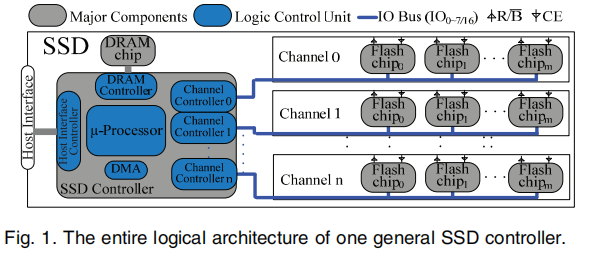
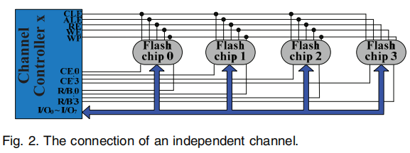
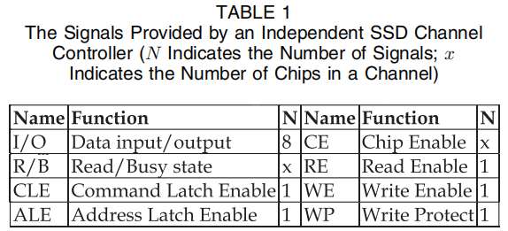
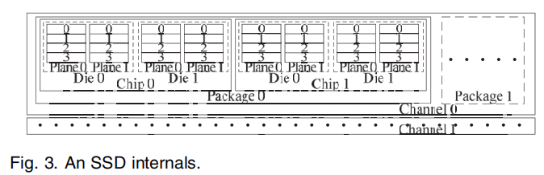
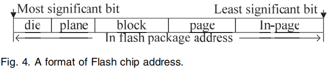
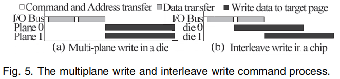
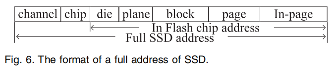

 1. 讨论了使用 die-level 和 plane-level parallelism相关的advanced commands对performance和endurance的影响
 2. 评估了使用与开发四层并行性密切相关的不同分配方案对performance和endurance的影响
 3. 研究了利用SSD中并行性的最优先级
[原文链接](http://www-users.cselabs.umn.edu/classes/Spring-2017/csci5980/files/SSD/SSD-Multi-Channel-Parallelism.pdf)
<!--more-->

>最近看的paper都是关于SSD结构啦，性能研究啦之类的，仔细去读的话，还是感觉蛮有意思的，不过这块内容涉及到底层系统，需要一定的知识储备。比如channel，chip，die，plane等的层层嵌套关系。
在本文中对于这些基础概念作了详细的说明，这篇文章是发表在国际顶级A类期刊TOC上的文章，昨天看了一个下午加晚上，今天继续坚持将它看完，下面一起来了解下吧~

### 要点

**Motivation**
 1. advanced commands 在plane-level并发和die-level并发中使用，我们需要考虑哪些问题？
 2. 如果考虑advanced commands 和多级并发，如何设计静态分配和动态分配方案？这两种方案的performance和endurance区别？如何选择合适的分配方案？
 3. 在ssd中使用四级并发，最好的优先级顺序？
 
---

* 近年来，ssd发展迅速，但其价格昂贵，采用了很多种方法来降低价格，主要在

	1. increase the per-unit capacity
	2. improve the reliability
	3. address the random-write performance penalty for enterprise quality Flash memory storage

* 根据文章题目，我们要研究的ssd的performance和endurance，那么影响这两个参数的有三个内在的因素：

	1. advanced commands （高级命令）
	2. allocation schemes（分配策略）
	3. priority order of ssd parallelism levels（优先级）
	
在这篇文章中，研究表明前两项的因素和第三项因素密切相关

#### ** Advanced commands **
* 操作：read ，write ， erase
* commands： copyback ， multiplane ，interleave
* 要合理的使用commands，比如不合理的使用copyback命令会显著增加擦除计数和平均响应时间

#### ** allocation schemes **
  - 动态分配和静态分配
  动态分配：更为灵活，更适应并发
  静态分配：逻辑页和物理页之间可以通过公式计算
  在所有工作负载下，静态分配在处理读请求方面始终表现最佳，而在大多数工作负载下，动态分配在写、总体性能和耐力方面都优于其他分配。

#### ** priority order of ssd parallelism levels **

可以并发执行的四层：channel-level，chip-level，die-level，plane-level

`高级命令`利用最后两个级别的并行性；`分配方案`可以有效地利用多个级别的并行性，并确定它们的优先级顺序。评价结果表明，在四层并行性中，往往存在一个最优先级顺序。不正确的优先级顺序会导致高达60%的性能下降

* * *

### 关于闪存
#### 闪存类型
闪存分为两种类型：NOR-Flash Memory和NAND-Flash Memory
- 区别：
NOR-Flash Memory：字节级随机访问，用于只读型应用，比如存储固件代码
NAND-Flash Memory：页面级随机访问；高存储密度，大容量，低开销；用于通用型应用，比如用户信息存储

#### ssd控制器逻辑架构
为了增加存储密度，Flash制造商将几个Flash chips聚合到一个名为Package的模块中。在package中的所有chips共享相同的8/16-bit-I/O总线，但将chip enable(CE)和ready/busy(R/B)控制信号分开

- 每个`chips` 有很多个dies组成
- 每个`die`有很多个planes组成，每个die有一个R/B信号，只在advanced commands中起作用
- 每个`plane`包含成千上万的blocks和一个data register
- 一个`block`包含64个或者128个pages，一个page又被划分为很多个512-byte的subpages，相当于典型的扇区大小
- 每个`subpage`包含16-byte的空闲区域用来存储metadata

**区分chip和die？**

- chip是具有独立CE和R/B信号的基本服务单元
- die是chip的组成组件，只有R/B信号

#### flash典型的物理特征

1.`write-after-erase`

- 在一个写操作之后，这个页必须被先擦除才能再次使用，也即写操作不能就地更新

2.`limited erase cycle`

- 每个Flash block的erase操作是有限的，若worn out，那么这个块就不能再使用
- 一个典型的erase操作上线大概为10k-100k

* * *

### 关于SSD
Flash memory SSD是一个嵌入式系统，主要是由存储部件（Flash memory chips）和控制部件（embedded CPU）组成，称之为SSD控制器，如下图

SSD控制器必须提供主机接口和Flash通道接口之间的连接。一般来说，对于一个SSD，只有一个主机接口可以与主机连接，例如PATA，SATA、SAS、PCI-E等；
相比之下，有多个Flash通道接口可以连接SSD控制器内的多个独立通道，以提高SSD的容量并提高其I/O性能
基于Flash chip控制信号和数据信号的不同共享方式，有多种实现Flash存储通道接口的方法。
下图设计的SSD控制器致力于高性能，称为`独立信道`

Flash通道控制器不仅消耗逻辑单元资源，而且消耗用户I/O引脚资源。

在表1中列出了Flash channel所需的所有信号。如果我们在一个channel中使用四个chip，每个channel将消耗21个用户I/O引脚。
因此，独立的Flash通道号受到有限的逻辑单元和用户I/O引脚资源的限制。

#### SSD的并行性
在SSD中有四级并行性：
1. channel level（among channels）
2. chip level(among chips in a channel)
3. die level(among dies in a chip)
4. plane level(among planes in a die)

如果一个请求同时被channel0和channel1服务，那么要求channel-level的并行性，其他三个level同理。

事实上，除了channel-level parallelism外，其他三个层次的并行性可以提高独立信道的利用率。
同时，由于目前异步Flash I/O总线的技术限制，最大带宽为40 MB/秒。因此，通过利用`chip-level`、`die-level`和`plane-level`并行，就有可能实现这一最大带宽。

* * *

### 基本命令和高级命令
#### 基本命令
三种basic Command：read、write、erase

- 一个`read`命令主要是从一个target page中抓取数据
- 一个`write`命令写数据到一个target page
- 一个`erase`命令将目标块的所有位重置为“1”

每个读/写命令操作由两个步骤组成

1. 数据传输
2. 在target page上读数据到plane data register或者从plane data register写数据到target page

通过将命令代码写入命令寄存器以及将请求的地址写入地址寄存器来启动所有命令。

地址是指请求的target data在chip内的位置。如图4所示，A Flash chip地址分为五部分：die、plane、block、page、in-page。在block中，页面必须按照页面地址的升序连续写入。Random-page-address是禁止的，我们称此限制为`Ra`

#### 高级命令
大多数Flash制造商提供高级命令，如copyback，multiplane，interleave，以进一步提高SSD的性能。
高级命令是basic read, program 和 erase commands的扩展，但有一些使用限制

1. `Copyback(Internal Data Move)`
- 此命令是在相同的plane之间将数据从一个page复制到另一个page，不需要占用I/O bus
- 该命令可节省两次数据传输时间
- 源页和目标页必须具有相同的die和plane地址，它们的地址必须是奇数或偶数。如图3所示，copyback命令操作只能将数据从第0页到第2页，或从第1页到第3页，以此类推。禁止将数据从0页移动到第1页或第3页。我们称之为限制`Rb`

2. Multiplane
- 此命令在同一die的所有plane上激活多个读取、编程或擦除操作
- 该命令使用plane-level parallelism
- 仅花费多个数据的传输和一个read、write或者erase来实现多个read、write、erase，如图5a
- 执行multiplane读/写操作的pages必须具有相同的die、block和page地址
- blocks执行一个multiplane erase操作必须有相同的die和block地址，如图3，只有来自plane0的page1和来自相同的die的plane1的page1才能通过使用multiplane 的读/写操作同时读写。读/写来自plane0的page1和来自plane1的page3，使用multiplane 读/写操作是禁止的，称为限制`Rc`

3. Interleave
- 此命令在相同chip下的不同dies同时执行一些read、write、erase和multiplane read/write/erase操作
- 使用die-level并行
- 注意interleave command和interleave operation不一样，interleave command是闪存命令，在相同的chip上的不同dies执行；interleave operation 在相同的channel上的不同chips上执行
- interleave write command如图5b所示

* * *

### Allocation Schemes

——分配方案确定如何选择空闲物理页以适应要写入SSD的逻辑页

为了定位特定的物理页，除了知道die address，plane address，block address和page address外，必须知道channel address和chip address，如图4展示的格式
SSD的完整地址的格式如图6所示

- 静态分配
	1. 首先按照公式计算逻辑页对应于哪个channel、chip和plane，若已占有则分配给plane的任何空闲物理页面

- 动态分配
    1. 将逻辑页分配给整个ssd的任何空闲物理页
    2. 当写入请求到达时，动态分配方案通过考虑几个因素来选择空闲的物理页面，例如channels和chips的空闲/繁忙状态、blocks的擦除计数、 并行级的优先级顺序等等

***************************************
*****platform和experiment，不码字了，此处省略3千字……*****
***************************************

### 小小总结一哈
SSD中有四种并行级，分别是`channel-level parallelism`, `chip-level parallelism`, `die-level parallelism`, `plane-level parallelism`

 1. 讨论了使用 die-level 和 plane-level parallelism相关的advanced commands对performance和endurance的影响
 2. 评估了使用与开发四层并行性密切相关的不同分配方案对performance和endurance的影响
 3. 研究了利用SSD中并行性的最优先级，实验分析如下：

	- 有两种使用高级命令的推荐方法，使用Copyback、mpw和interleave命令与使用Copyback命令wisely，MPW指挥blindly，interleave命令 ubiquitously效果一样
	- 静态分配算法在读方面性能是最好的；在大多数工作负载下，动态分配在写和总体性能以及耐力方面表现最好
	- 利用SSD中并行性的最优先级顺序是：channel-level并行——die-level并行——plane-level平行——chip-level并行
	- 基于这些,深入探讨了高性能SSD的设计准则，并给出了一个设计实例

### "I want to say"
>临近期中，事情比较多，不过坚持看paper写博文转眼已经快两个月辣，坚持这件小事说难也不难嘛！fighting✌

