1. 记录我在阅读SSDsim源码过程中遇到的问题和一些比较重要的知识点
2. 简要介绍上述三篇论文所做的工作

<!--more-->

>之前写的两篇博文都是介绍了ssd内部结构，并提出方法来提高ssd性能问题。这一礼拜看了ssdsim改进后的源码和另外的一些论文。上周五老师给我讲解了下三篇论文，对ssd内部并行处理，对不同类型的应用请求动态调整闪存资源等有了深入的理解，越了解发现越有意思O(∩_∩)O哈哈~ 欸欸，只是最近整理博文的时间很少，看东西感觉也太慢了，都是些零零散散的碎片知识，不能够太慢呐，得加把油了！

原文链接：
1. [AutoSSD: an Autonomic SSD Architecture](https://www.usenix.org/system/files/conference/atc18/atc18-kim.pdf) 作者: Bryan S. Kim， 2018
[PPT](https://www.usenix.org/sites/default/files/conference/protected-files/atc18_slides_kim.pdf)
2. [Utilitarian Performance Isolation in Shared SSDs](https://www.usenix.org/system/files/conference/hotstorage18/hotstorage18-paper-kim-bryan.pdf)  作者： Bryan S. Kim，2018
 [PPT](https://www.usenix.org/sites/default/files/conference/protected-files/hotstorage18_slides_kim.pdf)
3. [Towards SLO Complying SSDs Through OPS Isolation](https://www.usenix.org/system/files/conference/fast15/fast15-paper-kim-jaeho.pdf) 作者：Jaeho Kim,2015
 [PPT](https://www.usenix.org/sites/default/files/conference/protected-files/fast15_slides_kim-jaeho.pdf)
 [presentation video](https://2459d6dc103cb5933875-c0245c5c937c5dedcca3f1764ecc9b2f.ssl.cf2.rackcdn.com/fast15/kim_towards.mp4)

* * * 

ssdsim是一款固态硬盘的仿真软件
## 动态映射和静态映射

动态映射和静态映射？解读process函数
动态映射下，通过在process（）对channel的for循环，判断当前channel是否为空闲，若channel空闲，则对当前channel的chip进行访问（chip_token）；方式是从请求队列中取请求加入当前空闲channel的chip中。
静态映射下，在process中对当前channel下的所有chip进行循环，循环过程中，从channel的请求队列ssd（ssd->channel_head[channel].sub_w_head）中判断是否存在未处理的请求，若有，访问当前chip。

PS：
struct sub_request *subs_w_head;   //当采用全动态分配时，分配是不知道应该挂载哪个channel上，所以先挂在ssd上，等进入process函数时才挂到相应的channel的读请求队列上

## 关于GC

先来了解以下几个概念：
`lsn`：逻辑扇区
`lpn`：逻辑页号
`ppn`：物理页号
利用逻辑扇区号可以计算出逻辑页号，lpn=lsn/ssd->parameter->subpage_page;

`GC操作`是由于某个plane的free块少于阈值而触发，当某个plane被触发时，GC操作占据这个plane所在的die，因为die是一个独立单元。对一个die的GC操作，尽量做到四个plane同时erase，利用interleave erase操作。GC操作应该做到可以随时停止（移动数据和擦除时不行，但是间隙时间可以停止GC操作），以服务新到达的请求，当请求服务完后，利用请求间隙时间，继续GC操作。可以设置两个GC阈值，一个`软阈值`，一个`硬阈值`。`软阈值`表示到达该阈值后，可以开始主动的GC操作，利用间歇时间，GC可以被新到的请求中断；当到达`硬阈值`后，强制性执行GC操作，且此GC操作不能被中断，直到回到硬阈值以上。

当产生一个GC操作时，将这个结构挂在相应的channel上，等待channel空闲时，发出GC操作命令

对于GC操作，要求每个channel都遍历一遍，在遍历channel的时候判断每个gc_node，查找每一个gc_node，获取gc_node所在的chip的当前状态，下个状态，下个状态的预计时间
    *如果当前状态是空闲，或是下个状态是空闲而下个状态的预计时间小于当前时间，并且是不可中断的gc
    *那么就flag_priority令为1，否则为0

`flag`用来标记gc函数是在ssd整个都是idle的情况下被调用的（flag=1），还是确定了channel，chip，die，plane被调用（flag=0）

进入gc函数，需要`判断是否是不可中断的gc操作`，如果是，需要将一整块目标block完全擦除后才算完成；如果是可中断的，在进行GC操作前，需要判断该channel，die是否有子请求在等待操作，如果没有则开始一步一步的操作，找到目标块后(`get_ppn_for_gc`函数为GC操作寻找新的ppn；因为在gc操作中需要找到新的物理块存放原来物理块上的数据，`在gc中寻找新物理块的函数，不会引起循环的gc操作`)，每次执行一个copyback操作，跳出gc函数，待时间向前推进后，再做下一个copyback或者erase操作
___

## Paper
### 1. AutoSSD: an Autonomic SSD Architecture
第一作者是Bryan S.Kim,首尔大学（Seoul National University),发表于2018年Usenix ATC上
#### FTL tasks
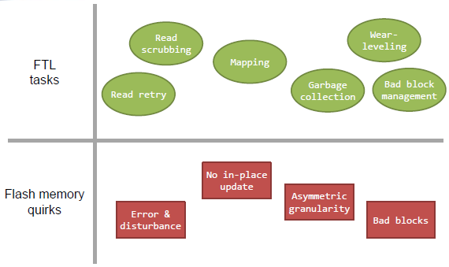

- FTL任务
	重读、读擦拭、map映射、GC操作、磨损均衡、坏块管理等等
    其中，什么是 read scrubbing？
    读操作是用一定的电量去相应单元测试，当读的次数多了，相应位置上的电量会产生变化，所有一定次数之后，需要将读出的数写到；另外单元，然后当前单元擦掉
- 闪存怪癖：
	1.错误和干扰
	2.不能就地更新，write操作的时候，若原先块上有数据，不能直接覆盖写，只能写在另一空闲快上，然后当前块设为Invalid
	3.不对称的粒度
	4.坏块，一般坏块达到2%，这块ssd就不能用了，虽然看这个数字很小，但是ssd是基于磨损均衡的，2%的块是坏块了，那么很快就会有20%、40%等等

#### 存在的方法
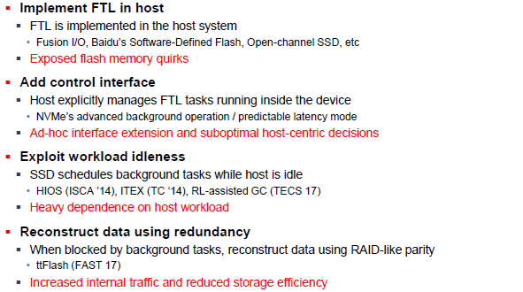

#### 本文的方法
##### Autonomic SSD
1. Make device-centric decisions
2. Work under sustained I/O
3. Be FTL implementation-agnostic

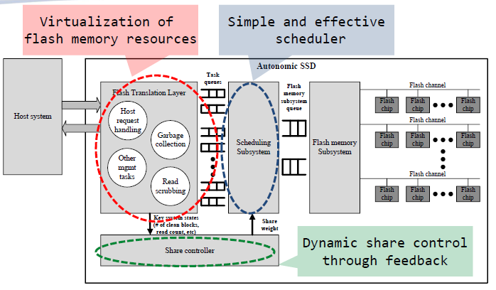

在Flash Translation layer中，将各个任务分为独立的任务，各自有相应的Task queues，产生的请求放入相应的队列
Scheduling Subsystem用来取任务队列中的请求放入闪存子系统队列
Share controller调节闪存传输层产生的请求和请求队列中请求的数目之间的反馈；如果请求数目过多，那么就不要再将请求放入队列中了

**self-manages FTL tasks**
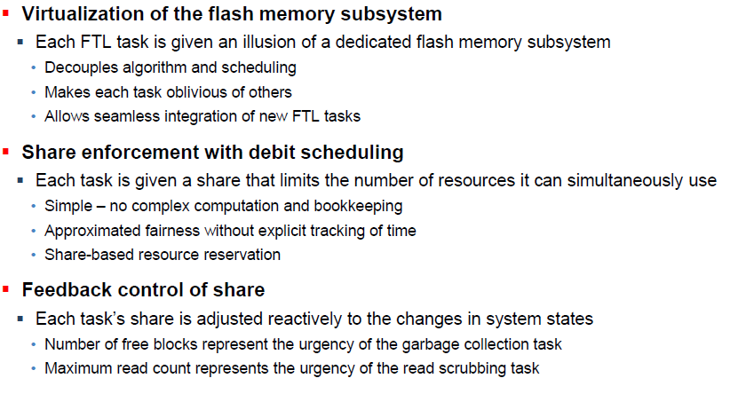

##### Debit Scheduling

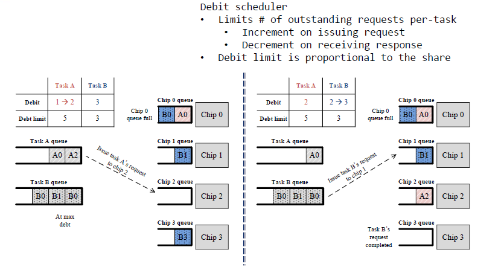

- 在上述A和B任务队列中，任务A的限制数量为5个请求数目，任务B的请求数目限制为3个
- 左边图中显示，此时任务B产生的B0、B1、B3均已放入chip0、chip1、chip3中；任务A产生的A0已放入chip0
- 此时，B的请求数目到达上限，但是A未到达上限，仍可产生请求放入队列
- 接下来，唯一符合条件的调度是向Chip2发出任务A的请求
- 右边图，当任务A仍处于限制之下时，其请求不能发送给具有完整队列的芯片，因为chip0已经满了。另一方面，当任务B的B3在chip3上的请求操作完成时，可以接收来自任务B的请求，且是B1，可以是乱序的

**Share controller**
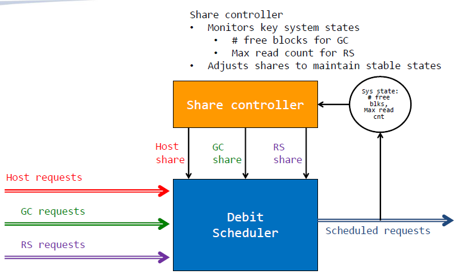

#### 总结一哈
在本文中，介绍了automatic SSD架构的设计，该架构可以自动管理闪存存储中的并发FTL任务。通过协调闪存子系统中资源的使用，自主SSD管理并发FTL任务的进度并将存储的内部系统状态维持在稳定水平

### 2. Utilitarian Performance Isolation in Shared SSDs
作者是Bryan S.Kim,首尔大学（Seoul National University),发表于2018年HotStorage上
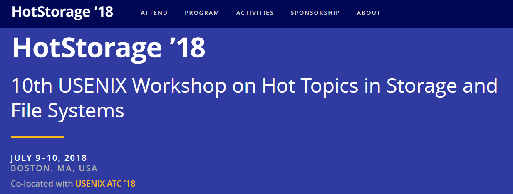

>在本文中，为多个共享单个SSD的租户提出了一种实用性能隔离（UPI）方案。UPI考虑每个租户的效用并动态分配资源，以便可以充分利用SSD的固有并行性，同时减轻租户间I/O干扰

**闪存蓝图：**
历史上，大多数SSD使用如SATA、SAS或光纤通道等接口与计算机接口的总线连接。随着固态硬盘在大众市场上的流行，SATA已成为个人电脑中连接SSD的最典型方式;但是，SATA的设计主要是作为机械硬盘驱动器(HDD)的接口，并随着时间的推移越来越难满足速度日益提高的SSD。随着在大众市场的流行，许多固态硬盘的数据速率提升已经放缓。不同于机械硬盘，部分SSD已受到SATA最大吞吐量的限制。

在NVMe出现之前，高端SSD只得以采用PCI Express总线制造，但需使用非标准规范的接口。若使用标准化的SSD接口，操作系统只需要一个驱动程序就能使用匹配规范的所有SSD。这也意味着每个SSD制造商不必用额外的资源来设计特定接口的驱动程序。

在2013年提出了NVMe这个并行处理的物件，物理接口采用PCI-Express总线（在host system中），传输协议是在NVMe上，NVMe是专门针对PCIe SSD设计的接口标准，因此本文的工作主要是基于NVMe的。
注意，以前是串行的，闪存虽是并行通道，但是上面的请求数量来得比较慢，来得及处理，但现在改成NVMe后，下面闪存设备的工作就变得非常繁忙，如何对闪存的并行处理方面进行改进呢？这就是下面要探讨的问题
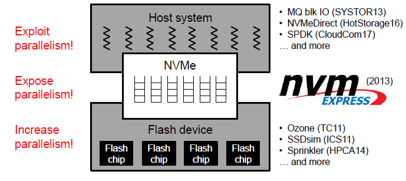

当然已经做了很多工作了，目前在看的SSDsim就是一个闪存模拟器

#### Unified sharing of resources（free-for-all）
（统一共享资源（免费））
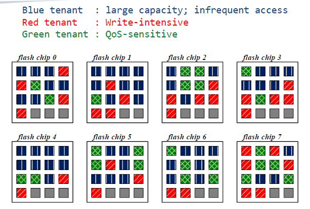

这种分配方式是资源统一共享的，图中所示的三个不同类型的应用都可以使用8个chip，可见，三个应用的数据杂乱无章的分布在8块chip上，那么我们来看下这三个应用的类型
`蓝色租户`：所需容量大，不频繁的访问（看上去非常友好了，因为不需要频繁的读写，这样虽然占用一定数量的chip但是GC操作少）
`红色租户`：写集中（会带来频繁的GC操作）
`绿色租户`：对服务质量要求很高（quality of service）
因此红色租户尽量不要和绿色租户共用一块chip，原因是当进行GC操作的时候会影响服务质量。也就是说对服务质量要求比较高的租户更喜欢将数据和其他人分开

#### Partitioning of resources（egalitarian）
（资源分配（平等））
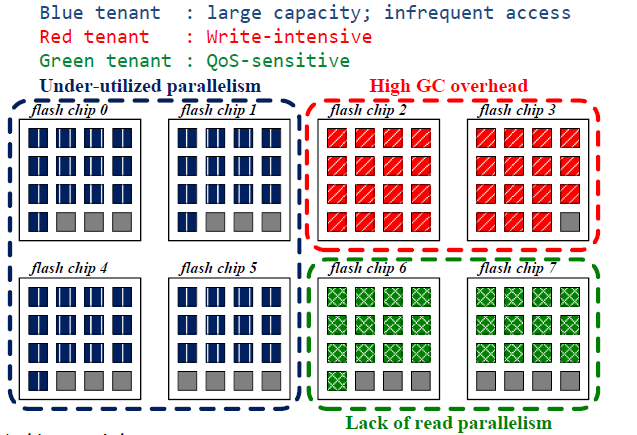

这种分配方式是平等的分配资源，也就是按照资源需求数量进行分配，那么蓝色分到的是4块chip，红色是2块chip，绿色是2块chip
但是上述分配方式会出现以下问题：
限制了整体的利用率，蓝色区域使用很不频繁，而红色和绿色区域使用非常频繁，但是资源又不多，比如GC操作的时候，很快就到达阈值，那么会产生频繁的GC操作。

##### Slashing parallelism for isolation
（削减并行性以实现隔离）
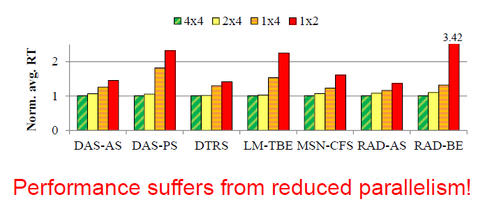

上图显示的是不同并行程度下，各类型的租户平均时间的统计。可见并行程度降低之后，各类型的应用平均响应时间增加，且不同的应用情况不同。

#### Dynamic allocation of resources（utilitarian）
（资源的动态分配（功利））
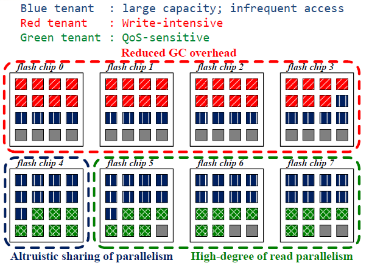

上述分配方案将不频繁使用的蓝色租户分别与红色和绿色租户共用chip，如上述所示。此分配方案对于红色租户，可减小写操作频繁带来的GC；对于绿色租户，提高读并行程度；而红色租户于绿色租户是分开的，也不会影响服务质量

##### 从isolation调整到utilitarian
**Load balancing**
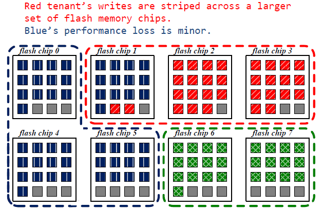

**data relocation**
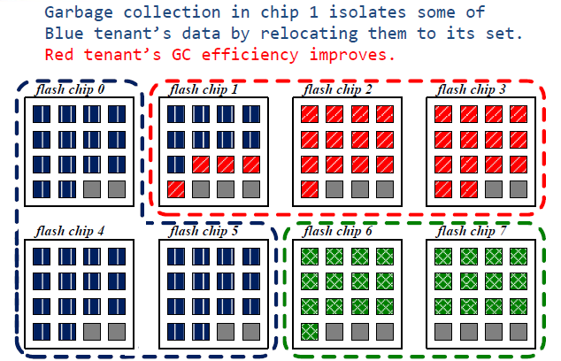

从上面一张图到下面张图，进行动态分配的过程中，由于将蓝色一块chip的控制权给了红色，那么对于在chip1上面的操作，若是蓝色写请求的话，只会写在0,4,5上，然后当前块为无效块，因此，就不断将chip1上的蓝色快迁移至0,4,5号chip上，红色租户的GC操作效率可提高

#### 总结一哈
在本文中，为多个共享单个SSD的租户提出了一种实用性能隔离（UPI）方案。UPI考虑每个租户的效用并动态分配资源，以便可以充分利用SSD的固有并行性，同时减轻租户间I/O干扰。

初步实验结果，对于延迟敏感的工作负载，UPI将99％的QoS性能降低38.5％，而高吞吐量工作负载的平均性能降低了16.1％。此设计可以在多个方向进行扩展，例如为租户提供非对称服务，并探索平均和尾部(也可以说hi最后那1%）延迟性能之间的权衡

>大概思路是这样子，对实验结果图就不写在博文上了，发在usenix上的paper均可以找得到slides，可以去看看，有的还有vedio讲解，虽然是英文的哈哈

- - -

### 3. Towards SLO Complying SSDs Through OPS Isolation
作者：Jaeho Kim，首尔大学，发表在2015年USENIX Conference on FAST

我们都知道，闪存中，并不是所有的空间都留给用户来用的，其中一部分要留做GC操作时写入新的block，就好像我们新买的U盘常常缩水，就是这个原因。
本文是考虑了单个chip，动态调整OPS的大小来实现资源的高效率应用。
>个人觉得这种方法没有那么好

## “I want to say”
对上述三篇ssd方面的paper进行简要概述，对在源码阅读过程中的一些小小的问题进行总结。希望自己能快速的投入到这方面的研究！

